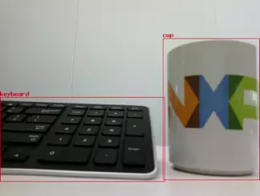
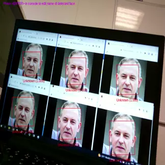
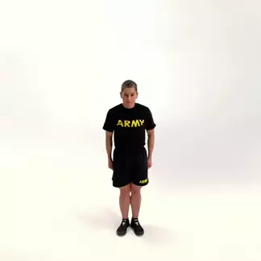

# NXP eIQ® Vision Model Zoo

> A collection of machine learning models for computer vision applications, optimized for NXP MCUs and MPUs.

## Description

The NXP eIQ® Vision Model Zoo offers pre-trained models for a variety of domains and tasks that are ready to be deployed on supported products.

Models are included in the form of "recipes" that convert the original models to TensorFlow Lite format.
This allows users to find the original re-trainable versions of the models, allowing fine-tuning/training if required.

This should facilitate the development of embedded AI with NXP products.

## Supported Products and Machine Learning Frameworks

Models are provided in TensorFlow Lite format.

The list of currently supported platforms can be found in [the products folder](./products/).

## NXP eIQ® Vision Model Zoo layout

The NXP eIQ® Vision Model Zoo is structured in the following way: Main Page -> Task -> Model.

Multiple models may be proposed for the same task. Each model has its own information page.

## List of tasks

The Vision domain includes all tasks related to image and video processing. Below is a table of the currently supported tasks.
Follow the links to each domain to access the models.

Task | Description | Input Type | Output Type | Example
---  | ---         | ---        | ---         | ---
[Image Classification](./tasks/classification/) | Image Classification is a fundamental task that attempts to comprehend an entire image as a whole.   The goal is to classify the image by assigning it to a specific label.   Typically, Image Classification refers to images in which only one object appears and is analyzed. | Image | Label |  
[Object Detection](./tasks/object-detection/) | Object detection is the task of detecting instances of objects of a certain class within an image.   A bounding box and a class label are found for each detected object.  | Image | Bounding Boxes + Labels | 
[Face Recognition](./tasks/face-recognition/) | Face recognition is the task of matching an input face image to a databases of known faces.   A face feature vector is regressed by the model and compared to the known feature vectors. | Image | Face feature vector | 
[Semantic Segmentation](./tasks/semantic-segmentation/) | Semantic segmentation is the task of assigning a class to each pixel of an input image. It does not separate the different instances of objects.   The output is a 2D image containing the segments for each class. | Image | Segmentation map | 
[Pose Estimation](./tasks/pose-estimation/) | The goal of pose estimation is to detect the position and orientation of a person or object. In Human Pose Estimation, this is usually done with specific keypoints such as hands, head, legs, etc. | Image | Keypoint positions | 

## Requirements

The model creation recipes were tested under Ubuntu 20.04 with Python 3.8.

## Legal information

Copyright NXP 2023

The code in this repository is provided under [MIT License](https://choosealicense.com/licenses/mit/).
