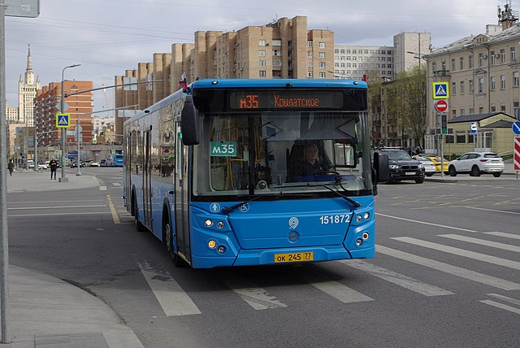
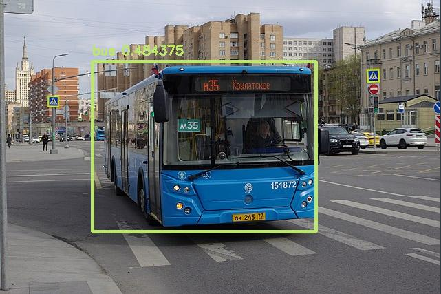

# NanoDet

## Introduction

["NanoDet"](https://github.com/RangiLyu/nanodet) is a lightweight object detection model designed to run in real time on mobile devices. Specifically, we use the NanoDet-m-0.5x variant.
It regresses bounding boxes (4 coordinates) and a confidence score for each box. The bounding box decoding and non-maximum suppression (NMS) steps are NOT included in the model.
Please look at `example.py` for an example of implementation of box decoding and NMS.

This model has been modified by NXP to only keep the coarsest output stride. This means that the model is only able to detect medium to large objects but the inference and decoding of result is very fast.
This makes the model more suitable for use on low-power MCUs.

## Model Information

Information   | Value
---           | ---
Input shape   | RGB image (320, 320, 3)
Input example |  ([Image source](https://commons.wikimedia.org/wiki/File:Moscow_bus_151872_2022-05.jpg), Public domain)
Output shape  | Tensor of size (10, 10, 80) containing bounding box scores. Tensor of size (10, 10, 32) containing bounding box coordinates (not decoded).
Output example | 
FLOPS | 158.069 MOPS
Number of parameters | 204,179
File size (int8) | 364KB
Source framework | Pytorch
Target platform | MPUs, MCUs

## Version and changelog

Initial release of quantized int8 model.

## Tested configurations

The int8 model has been tested on i.MX 8MP using benchmark-model and i.MX RT 1170 using TensorFlow Lite Micro.

## Training and evaluation

The model has been trained and evaluated on the [COCO dataset](https://cocodataset.org/) [1], which features 80 classes.
It achieved a score of 13.5mAP on the test set, according to [the source of the model](https://github.com/RangiLyu/nanodet#model-zoo).
However, since we only use the largest stride of the model, the actual final accuracy is much lower.
The performance of the quantized model has been evaluated using the `evaluate.py` script.
The model achieves 4.3mAP. However, it still achieves 9.4AP on large objects, thus, this model is functional for basic object detection use cases.

## Conversion/Quantization

The original model is converted from PyTorch to TensorFlow, and then to TensorFlow Lite.

The conversion script performs this conversion and outputs the int8 quantized model.
100 random images from the COCO 2017 validation dataset are used as calibration for the quantization.

## Use case and limitations

This model can be used for very fast medium to large object detection on 320x320 pixel images.
It is not a very accurate model and should only be used for basic use cases.

## Performance

Here are performance figures evaluated on i.MX 8M Plus, i.MX RT1170 and i.MX RT1050:

Model   | Average latency | Platform    | Accelerator | Command
---     | ---             | ---         | ---         | ---
Int8    | 89.4ms          | i.MX 8M Plus|   CPU       | /usr/bin/tensorflow-lite-2.10.0/examples/benchmark_model --graph=nanodet_m_0.5x.tflite
Int8    | 11.9ms          | i.MX 8M Plus|   NPU       | /usr/bin/tensorflow-lite-2.10.0/examples/benchmark_model --graph=nanodet_m_0.5x.tflite  --external_delegate_path=/usr/lib/libvx_delegate.so
Int8    | 78.2ms          | i.MX 93     |   CPU       | /usr/bin/tensorflow-lite-2.10.0/examples/benchmark_model --graph=nanodet_m_0.5x.tflite
Int8    | 615ms           | i.MX RT1170 |   CPU       | Used with TensorFlow Lite micro
Int8    | 771ms           | i.MX RT1050 |   CPU       | Used with TensorFlow Lite micro

## Download and run

To create the TensorFlow Lite model fully quantized in int8 with int8 input and output, run:

    bash recipe.sh

The TensorFlow Lite model file for i.MX 8M Plus and i.MX RT 1170/1050 is `nanodet_m_0.5x.tflite`.

An example of how to use the model is in `example.py`.

## Origin

Model implementation: https://github.com/RangiLyu/nanodet

[1] Lin, Tsung-Yi, et al. "Microsoft coco: Common objects in context." European conference on computer vision. Springer, Cham, 2014.
