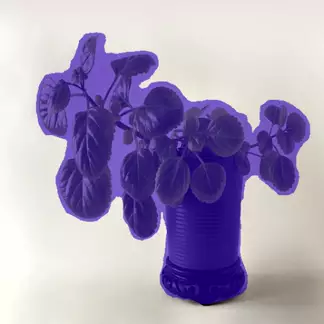

# Semantic Segmentation

 Semantic Segmentation is the task of assigning a class to each pixel of an image. Semantic segmentation itself does not find different instances of objects.

 

## Datasets

The semantic segmentation models featured in this Model Zoo are trained on the following datasets:

### PASCAL VOC 2012

The PASCAL Visual Object Classes (VOC) 2012 dataset[1] is a large-scale object detection and semantic segmentation dataset.

It contains contains 20 object categories including vehicles, household, animals, and other: aeroplane, bicycle, boat, bus, car, motorbike, train, bottle, chair, dining table, potted plant, sofa, TV/monitor, bird, cat, cow, dog, horse, sheep, and person. Each image in this dataset has pixel-level segmentation annotations, bounding box annotations, and object class annotations. This dataset has been widely used as a benchmark for object detection, semantic segmentation, and classification tasks. The PASCAL VOC dataset is split into three subsets: 1,464 images for training, 1,449 images for validation and a private testing set.

## Metrics

### mIoU

IoU is the area of overlap between the predicted segmentation and the ground truth divided by the area of union between the predicted segmentation and the ground truth. For binary (two classes) or multi-class segmentation, the mean IoU of the image is calculated by taking the IoU of each class and averaging them.

## Model List

Model name                                   | Architecture | Backbone              | Training Dataset | mIoU FP32    | mIoU INT8 | Input size | OPS    | Params  | FP32 Size    | INT8 Size |  Compatibility
---                                          | ---          |     ---               | ---              | ---          | ---      | ---         |  ---   | ---     |  ---         |    ---    | ---
[DeepLabV3](./deeplabv3/README.md)           | DeepLabV3[2] | MobileNetV2[3]        | PASCAL VOC 2012  | 0.7019 (val) | TODO     | 513x513     |  1.76B | TODO    |  7.6MB       |  983KB    | i.MX 8M Plus

## References

[1] Everingham, Mark, et al. "The pascal visual object classes (voc) challenge." International journal of computer vision 88 (2010): 303-338.

[2] Chen, Liang-Chieh, et al. "Encoder-decoder with atrous separable convolution for semantic image segmentation." Proceedings of the European conference on computer vision (ECCV). 2018.

[3] Sandler, Mark, et al. "Mobilenetv2: Inverted residuals and linear bottlenecks." Proceedings of the IEEE conference on computer vision and pattern recognition. 2018.