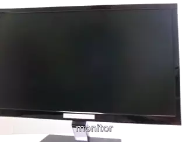
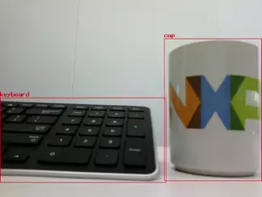
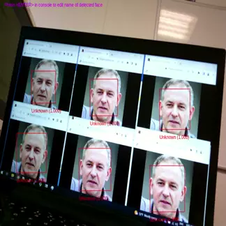
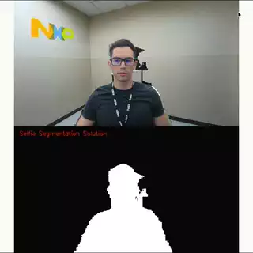
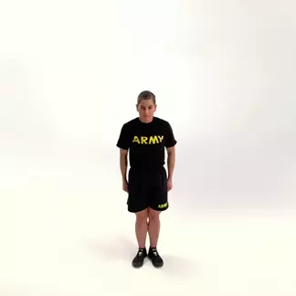
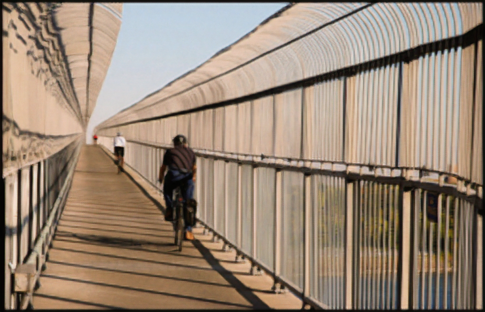
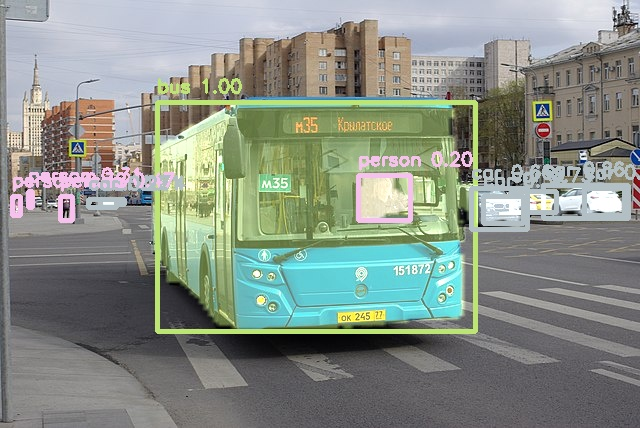
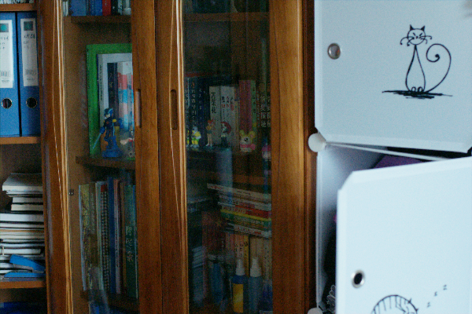

# Computer Vision

## List of tasks

The Vision domain includes all tasks related to image and video processing. Below is a table of the currently supported tasks.
Follow the links to each domain to access the models.

Task | Description | Input Type | Output Type | Example
---  | ---         | ---        | ---         | ---
[Image Classification](./classification/) | Image Classification is a fundamental task that attempts to comprehend an entire image as a whole.   The goal is to classify the image by assigning it to a specific label.   Typically, Image Classification refers to images in which only one object appears and is analyzed. | Image | Label |  
[Object Detection](./object-detection/) | Object detection is the task of detecting instances of objects of a certain class within an image.   A bounding box and a class label are found for each detected object.  | Image | Bounding Boxes + Labels | 
[Face Recognition](./face-recognition/) | Face recognition is the task of matching an input face image to a databases of known faces.   A face feature vector is regressed by the model and compared to the known feature vectors. | Image | Face feature vector | 
[Semantic Segmentation](./semantic-segmentation/) | Semantic segmentation is the task of assigning a class to each pixel of an input image. It does not separate the different instances of objects.   The output is a 2D image containing the segments for each class. | Image | Segmentation map | 
[Pose Estimation](./pose-estimation/) | The goal of pose estimation is to detect the position and orientation of a person or object. In Human Pose Estimation, this is usually done with specific keypoints such as hands, head, legs, etc. | Image | Keypoint positions | 
[Monocular Depth Estimation](./monocular-depth-estimation/) | The goal of monocular depth estimation is to estimate the depth of the scene at each pixel of a single input image. It is very useful in applications such as robotics. | Image | Depth map (image) | 
[Super Resolution](./super-resolution/) | Super Resolution is the task of upscaling a low resolution image while keeping most of its details. | Image | Image | 
[Instance Segmentation](./instance-segmentation/) | Instance Segmentation is the task of detecting instances of objects of a certain class within an image and creating a pixel-wise mask of each object. | Image | Bounding Boxes + Masks | 
[Low-light enhancement](./low-light-enhancement/) | Low-light enhancement is the task of brightening an image captured in low-light conditions. | Image | Image | 