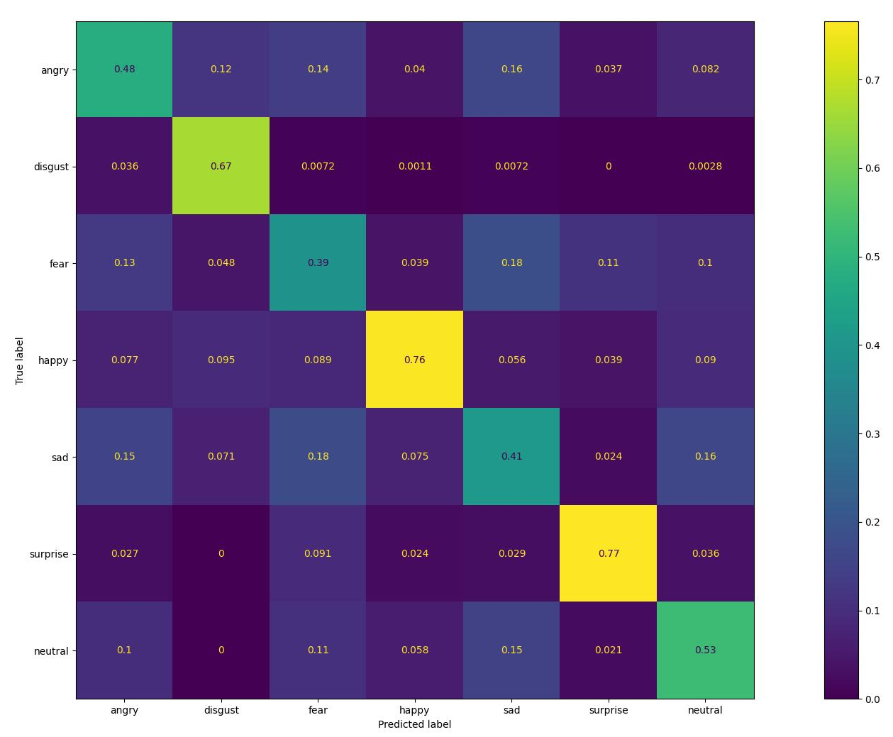

# Deepface-emotion

## Introduction

[Deepface-emotion](https://github.com/serengil/deepface) is a simple Convolutional Neural Network (CNN) for classification of face emotions.
We use the weights from the implementation found in [DeepFace](https://github.com/serengil/deepface/).

NB: This is not a face detection model. The faces have to be detected in the image and cropped before feeding them to Deepface-emotion.

## Model Information

Information   | Value
---           | ---
Input shape   | Grayscale face crop (48, 48, 1)
Input example |  (Image from FER2013 dataset [1])
Output shape  | Vector of probabilities shape (1, 7). Order of labels: angry, disgust, fear, happy, sad, surprise, neutral]
Output example | Output tensor: [[0., 0.,  0., 0.99609375, 0., 0., 0. ]] Recognized emotion: happy
FLOPS | 58.5 MOPS
Number of parameters | 23,497,424
Source framework | Tensorflow/Keras
Target platform | MPUs, MCUs

## Version and changelog

Initial release of float32 and quantized int8 model.

## Tested configurations

The float32 and int8 models have been tested on i.MX 8MP and i.MX 93 using benchmark-model (see [i.MX Machine Learning User Guide](https://www.nxp.com/docs/en/user-guide/IMX-MACHINE-LEARNING-UG.pdf)).

## Training and evaluation

The model has been trained and evaluated on the FER2013 dataset [1]. It achieved a score of 92.1% on the training set and 57.4% on the test set according to [the source of the model](https://github.com/serengil/deepface/).

The original training procedure is detailed [here](https://sefiks.com/2018/01/01/facial-expression-recognition-with-keras/).

We re-evaluated the floating point and int8 quantized model on the PrivateTest split:

Model | Accuracy
---|---
FaceNet512 Keras float32 | 56.5%
FaceNet512 TensorFlow Lite int8   | 56.8%

### Confusion matrix

The evaluation script used to create the confusion matrix is `evaluate.py`.

## Conversion/Quantization

The original model is directly converted from Keras to TensorFlow Lite.

The conversion script performs this conversion and outputs the float32 model and int8 quantized model.
100 random images from the training dataset are used as calibration for the quantization.

## Use case and limitations

This model can be used for simple emotion recognition applications. Since its accuracy on the test set is relatively low, it cannot be guaranteed to generalize well to new images.

## Performance

Here are performance figures evaluated on i.MX 8MP and i.MX 93 using BSP LF6.1.1_1.0.0:

Model   | Average latency | Platform    | Accelerator       | Command
---     | ---             | ---         | ---               | ---
Int8    | 9.05ms          | i.MX 8MP    |   CPU (1 thread)  | /usr/bin/tensorflow-lite-2.10.0/examples/benchmark_model --graph=emotion_uint8_float32.tflite
Int8    | 3.12ms          | i.MX 8MP    |   CPU (4 threads) | /usr/bin/tensorflow-lite-2.10.0/examples/benchmark_model --graph=emotion_uint8_float32.tflite --num_threads=4
Int8    | 2.02ms          | i.MX 8MP    |   NPU             | /usr/bin/tensorflow-lite-2.10.0/examples/benchmark_model --graph=emotion_uint8_float32.tflite --external_delegate_path=/usr/lib/libvx_delegate.so
Int8    | 4.21ms          | i.MX 93     |   CPU (1 thread)  | /usr/bin/tensorflow-lite-2.10.0/examples/benchmark_model --graph=emotion_uint8_float32.tflite
Int8    | 2.74ms          | i.MX 93     |   CPU (2 threads) | /usr/bin/tensorflow-lite-2.10.0/examples/benchmark_model --graph=emotion_uint8_float32.tflite --num_threads=2
Int8    | 0.61ms          | i.MX 93     |   NPU             | /usr/bin/tensorflow-lite-2.10.0/examples/benchmark_model --graph=emotion_uint8_float32_vela.tflite --external_delegate_path=/usr/lib/libethosu_delegate.so

## Download and run

To create the TensorFlow Lite model fully quantized in int8 with int8 input and float32 output, run:

    export KAGGLE_USERNAME='john'
    export KAGGLE_KEY='0123456789'
    bash recipe.sh

IMPORTANT: Before running `recipe.sh`, an account has to be created on [Kaggle](http://kaggle.com) in order to download the quantization calibration and evaluation dataset.
When the account is created, go to your Account page, create an API key and download it. Open the generated JSON file and write the contents in the `KAGGLE_USERNAME` and `KAGGLE_KEY` variables in the code snippet above.
Finally, accept the competition rules [Challenges in Representation Learning: Facial Expression Recognition Challenge](https://www.kaggle.com/competitions/challenges-in-representation-learning-facial-expression-recognition-challenge/data) to enable the data download.

The TensorFlow Lite model file for i.MX 8M Plus is `emotion_uint8_float32.tflite`. The file for i.MX 93 is output in the `model_imx93` directory.

An example of how to use the model is in `example.py`.

## Origin

Model implementation: https://github.com/serengil/deepface/

[1] Goodfellow, Ian J., et al. "Challenges in representation learning: A report on three machine learning contests." International conference on neural information processing. Springer, Berlin, Heidelberg, 2013.
