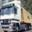

# Tiny ResNet

## Introduction

Tiny ResNet is small image classification model. The model is trained on small images (32 x 32) from CIFAR10 [1] dataset, distributed into 10 different classes.

We use model trained by [MLCommons](https://mlcommons.org/en/) available on their [GitHub page](https://github.com/mlcommons/tiny/tree/master/benchmark/training/image_classification) [2].

## Model Information

| Information          | Value                                                            |
|----------------------|------------------------------------------------------------------|
| Input shape          | RGB Color image (32, 32, 3)                                      |
| Input example        |  (Image from CIFAR10 dataset [1])   |
| Output shape         | Vector of probabilities shape (1, 10).                           |
| Output example       | Output tensor: [[0. 0. 0. 0.99609375 0. 0.00390625 0. 0. 0. 0.]] |
| FLOPS                | 25 MOPS                                                          |
| Number of parameters | 78,666                                                           |
| Source framework     | Tensorflow/Keras                                                 |
| Target platform      | MCUs, MPUs                                                       |

## Version and changelog

Initial release of quantized int8 model.

## Tested configurations

The quantized int8 models have been tested on i.MX 8M Plus using benchmark-model (see [i.MX Machine Learning User Guide](https://www.nxp.com/docs/en/user-guide/IMX-MACHINE-LEARNING-UG.pdf)).

## Training and evaluation

The model has been trained and evaluated on the [CIFAR-10](https://www.cs.toronto.edu/~kriz/cifar.html) dataset.
Training scripts are located in the model location folder on [Mlcommons Github](https://github.com/mlcommons/tiny/tree/master/benchmark/training/image_classification).

## Conversion / Quantization

The model is located in the source directory which contains original keras model (.h5), tflite float model and quantized int8 model. Quantization script can be found on the source code [GitHub page](https://github.com/mlcommons/tiny/blob/master/benchmark/training/image_classification/model_converter.py).

## Use case and limitations

Goal of the model is to classify input image into 10 classes. Classes are listed in the [Labels](#labels) section.

## Download and run

To download original keras model, tflite model and quantized tflite model, follow the top-level README instructions to install Docker and build the Docker image, then run the following command: 

    docker run --rm -v "$PWD:/workspace" nxp-model-zoo recipe.sh

The TFLite model file for i.MX 8M Plus and MCX N947 is `pretrainedResnet_quant.tflite`. Converted model for i.MX 93 is placed into `model_imx93` directory.

An example of how to use the model is in `utils/exmaple.py`. The output labels are listed in `labels.py`.

### How to run test inference:

```
 python utils/example.py --image=example_input.jpg
```

### Labels

- 'airplane',
- 'automobile',
- 'bird',
- 'cat',
- 'deer',
- 'dog',
- 'frog',
- 'horse',
- 'ship',
- 'truck'

## Origin

Model implementation: https://github.com/mlcommons/tiny/tree/master/benchmark/training/image_classification

[1]  [Learning Multiple Layers of Features from Tiny Images](https://www.cs.toronto.edu/~kriz/learning-features-2009-TR.pdf),
Alex Krizhevsky, 2009.

[2] Banbury, Colby, et al. "Mlperf tiny benchmark." arXiv preprint arXiv:2106.07597 (2021).
