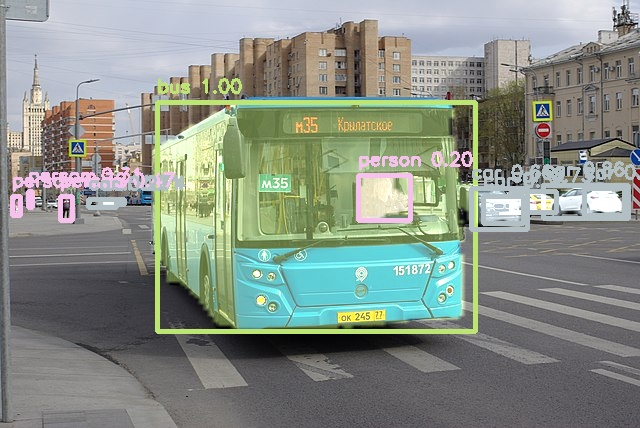

# YOLACT-Edge

## Introduction

["YOLACT-Edge-MobileNetV2"](https://tfhub.dev/sayakpaul/lite-model/YOLACT-Edge-mobilenetv2_dm05-int8/1/default/2) is a lightweight deep learning model for instance segmentation based on the YOLACT architecture [2]. This particular implementation uses the MobileNetV2 backbone [3] but other backbones can be used (see below for details).
It displays bounding boxes around the objects it detects and a mask for segmentation.
Please look at `example.py` for an example of implementation of post-processing and display of masks and bounding boxes.

## Model Information

Information   | Value
---           | ---
Input shape   | RGB image (550, 550, 3)
Input example |  ([Image source](https://commons.wikimedia.org/wiki/File:Moscow_bus_151872_2022-05.jpg), Public domain)
Output shape  | Tensor of size (1, 19248, 4) for the boxes' coordinates. Tensor of size (1, 80, 19248) for the scores. Tensor of size (1, 138, 138, 32) for the protos. Tensor of size (1, 19248, 32) for the masks. Final post-processing steps (to obtain the final masks) are done separately
Output example | 
FLOPS | 17G 
File size (int8) | 8.5M
Source framework | PyTorch
Target platform | MPUs

## Version and changelog

Initial release of quantized int8 model.

## Tested configurations

The int8 model has been tested on i.MX 8MP and i.MX 93 using benchmark-model.

## Training and evaluation

The model has been trained and evaluated on the [COCO dataset](https://cocodataset.org/) [1], which features 80 classes.
The floating point model achieved a score of 0.21 mAP on the test set, according to [the source of the model](https://github.com/haotian-liu/yolact_edge). It is to note that one can achieve up to 0.30 mAP using a Resnet 101 backbone.

## Conversion/Quantization

The original model is converted from PyTorch to ONNX by a [GitHub user](https://github.com/PINTO0309/yolact_edge_onnx_tensorrt_myriad/releases/tag/1.0.4) (**Note**: this link contains a number of other backbones for our model, if one wanted to change backbone, just download the corresponding yolact_edge_{backbone_name}_54_80000.onnx file and change the name of the file to convert in the recipe.sh file).

We convert the ONNX model to Tensorflow using the [onnx2tf package](https://github.com/PINTO0309/onnx2tf) then to TFLite.

The conversion script performs this conversion and outputs the quantized model.
100 random images from the COCO 2017 validation dataset are used as calibration for the quantization.

## Use case and limitations

This model obtains good accuracy figures and is quite lightweight. However, the runtime on CPU is still quite high as it was conceived for real-time usage with high-performance GPUs.

## Download and run

To create the TensorFlow Lite model fully quantized in int8 with int8 input and float32 output, follow the top-level README instructions to install Docker and build the Docker image, then run the following command: 

    docker run --rm -v "$PWD:/workspace" nxp-model-zoo recipe.sh

The TensorFlow Lite model file for i.MX 8M Plus and i.MX 93 is `YOLACT-Edge.tflite`.

An example of how to use the model is in `example.py`.

## Origin

Model implementation: https://github.com/haotian-liu/yolact_edge

[1] Lin, Tsung-Yi, et al. "Microsoft coco: Common objects in context." European conference on computer vision. Springer, Cham, 2014.

[2] Daniel Bolya, Chong Zhou, Fanyi Xiao, and Yong Jae Lee. Yolact: real-time instance segmentation. In ICCV, 2019.

[3] Sandler, Mark, et al. "Mobilenetv2: Inverted residuals and linear bottlenecks." Proceedings of the IEEE conference on computer vision and pattern recognition. 2018.