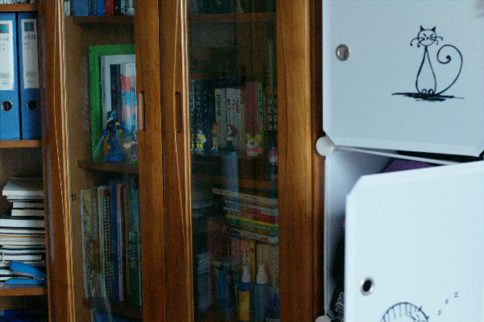

# SCI

## Introduction

SCI [1] is an ultralightweight low-light enhancement model.
It can make images brighter and clearer with minimal loss in detail.

## Model Information

Information   | Value
---           | ---
Input shape   | RGB image of shape (1080, 1920)
Input example |  (Image source: LOL dataset [2])
Output shape  | Tensor of shape (1080, 1920)
Output example | 
FLOPS | 752M
Number of parameters | 5.87K
File size (int8) | 8K
Source framework | PyTorch
Target platform | MPUs

## Version and changelog

Initial release of quantized int8 model.

## Tested configurations

The int8 model has been tested on i.MX 8MP and i.MX 93 using benchmark-model (see [i.MX Machine Learning User Guide](https://www.nxp.com/docs/en/user-guide/IMX-MACHINE-LEARNING-UG.pdf)).

## Training and evaluation

The model has been trained and evaluated on the LOL dataset. It achives comparable qualitative result to other low-light enhancement models while being noticeably faster according to [the source of the model](https://github.com/vis-opt-group/SCI).

## Conversion/Quantization

The recipe script downloads the pretrained models from the original repo, converts the PyTorch model to ONNX and then to Tensorflow (using [this](https://github.com/PINTO0309/onnx2tf) tool) after which it is finally quantized.

NB: The original model has dynamic shape, meaning that during the first step of conversion (PyTorch --> ONNX), the user can freely use a different shape than the one used in the demo. Here, we chose Full HD resolution (1920x1080) as a default value for the demo. If one wanted to change it, just change the value of the SIZE variable with the resolution you want in the recipe.sh file (and in the example.py file if needed).

## Use case and limitations

This model can be used for low-light enhancement on  images of all sizes.
The weights chosen for this demo are the 'medium' variant, meaning that the model was trained on a 'medium' difficulty dataset. The user can choose to use the 'difficult' or 'easy' variant. This will change the performance of the model and the inference time.

## Download and run

To create the TensorFlow Lite model fully quantized in int8 with float32 input and float32 output, follow the top-level README instructions to install Docker and build the Docker image, then run the following command: 

    docker run --rm -v "$PWD:/workspace" nxp-model-zoo recipe.sh

The TensorFlow Lite model file for i.MX 8M Plus and i.MX 93 is `sci.tflite`.

An example of how to use the model is in `example.py`.

## Origin

Model implementation: https://github.com/vis-opt-group/SCI

[1] Ma, Long and Ma, Tengyu and Liu, Risheng and Fan, Xin and Luo, Zhongxuan. Toward Fast, Flexible, and Robust Low-Light Image Enhancement In: Proceedings of the IEEE/CVF Conference on Computer Vision and Pattern Recognition, pages 5637-5646, 2022

[2] Wei Chen, Wenjing Wang, Wenhan Yang, and Jiaying Liu. Deep retinex decomposition for low-light enhancement. In British Machine Vision Conference, pages 1–12, 2018
