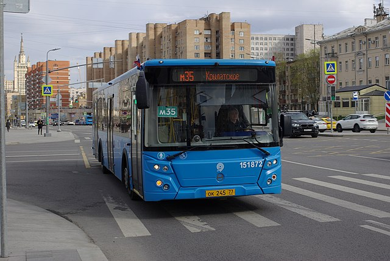

# MiDaS v2.1 Small

## Introduction

["MiDaS"](https://github.com/isl-org/MiDaS) [1] is a family of deep learning models for monocular depth estimation. Multiple versions have been created over the years. The first ones used Convolutional Neural Networks, while the later ones rely on Transformer architectures.
We chose to use the v2.1 Small variant, based on EfficientNet-lite [2] because it is the lightest and fastest.
Please look at `example.py` for an example of implementation of post-processing and display.

## Model Information

Information   | Value
---           | ---
Input shape   | RGB image (256, 256, 3)
Input example |  ([Image source](https://commons.wikimedia.org/wiki/File:Moscow_bus_151872_2022-05.jpg), Public domain)
Output shape  | Tensor of size (256, 256, 1) containing the depth map
Output example | 
FLOPS | 9.214GOPS
File size (int8) | 17MB
Source framework | PyTorch
Target platform | MPUs

## Version and changelog

Initial release of quantized int8 model.

## Tested configurations

The int8 model has been tested on i.MX 8MP (BSP 6.1.36_2.1.0_MX8MP) using benchmark-model.

## Training and evaluation

The model has been trained on 10 different datasets. The training procedure and dataset information are detailed in the [original repo](https://github.com/isl-org/MiDaS) and associated paper [1,3].

## Conversion/Quantization

The original model is converted from PyTorch to TensorFlow Lite float32 by the original authors. We convert it back to TensorFlow and quantize it to TensorFlow Lite int8.

The quantization procedure can be found in `recipe.sh`.

## Use case and limitations

This model can be used for real-time stereo depth estimation on mobile devices. However it is not as accurate as the state-of-the-art models that require faster hardware.

## Performance

Here are performance figures evaluated on i.MX 8M Plus (BSP L6.1.36_2.1.0):

Model   | Average latency  | Platform     | Accelerator       | Command
---     | ---              | ---          | ---               | ---
Int8    | 1285ms           | i.MX 8M Plus |   CPU (1 thread)  | /usr/bin/tensorflow-lite-2.11.1/examples/benchmark_model --graph=midas_2_1_small_int8.tflite
Int8    | 418ms            | i.MX 8M Plus |   CPU (4 threads) | /usr/bin/tensorflow-lite-2.11.1/examples/benchmark_model --graph=midas_2_1_small_int8.tflite --num_threads=4
Int8    | 32ms             | i.MX 8M Plus |   NPU             | /usr/bin/tensorflow-lite-2.11.1/examples/benchmark_model --graph=midas_2_1_small_int8.tflite --external_delegate_path=/usr/lib/libvx_delegate.so
Int8    | 543ms            | i.MX 93      |   CPU (1 thread)  | /usr/bin/tensorflow-lite-2.11.1/examples/benchmark_model --graph=midas_2_1_small_int8.tflite
Int8    | 346ms            | i.MX 93      |   CPU (2 threads) | /usr/bin/tensorflow-lite-2.11.1/examples/benchmark_model --graph=midas_2_1_small_int8.tflite --num_threads=2
Int8    | 32ms             | i.MX 93      |   NPU             | /usr/bin/tensorflow-lite-2.11.1/examples/benchmark_model --graph=midas_2_1_small_int8_vela.tflite --external_delegate_path=/usr/lib/libethosu_delegate.so

## Download and run

To create the TensorFlow Lite model fully quantized in int8 with float32 input and output, run:

    bash recipe.sh

The TensorFlow Lite model file for i.MX 8M Plus is `midas_2_1_small_int8.tflite`.
The non-quantized model will also be available as `midas_2_1_small_float32.tflite`.

The quantized model for i.MX 93 will be in `model_imx93`.

An example of how to use the model is in `example.py`.

## Origin

Model implementation: https://github.com/isl-org/MiDaS
Model weights downloaded from [TFHub](https://tfhub.dev/intel/lite-model/midas/v2_1_small/1/lite/1).

[1] Ranftl, René, et al. "Towards robust monocular depth estimation: Mixing datasets for zero-shot cross-dataset transfer." IEEE transactions on pattern analysis and machine intelligence 44.3 (2020): 1623-1637.

[2] https://blog.tensorflow.org/2020/03/higher-accuracy-on-vision-models-with-efficientnet-lite.html

[3] Ranftl, René, Alexey Bochkovskiy, and Vladlen Koltun. "Vision transformers for dense prediction." Proceedings of the IEEE/CVF international conference on computer vision. 2021.