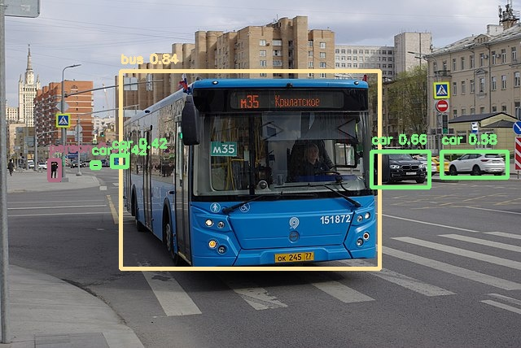

# CenterNet

## Introduction

CenterNet [1] is a one-stage object detection model that detects each object as a triplet, rather than a pair, of keypoints.
This particular implementation is based on the MobileNetV2 [2] backbone. It is to note however that this can be changed easily, 
the user can use a resnet backbone for example by changing the model link from the [the source of the model](https://github.com/tensorflow/models/blob/master/research/object_detection/g3doc/tf2_detection_zoo.md).

The post-processing steps are NOT included in the model.
Please look at `example.py` for an example of implementation of box decoding and NMS.

## Model

Information   | Value
---           | ---
Input shape   | RGB image (512, 512, 3)
Input example |  ([Image source](https://commons.wikimedia.org/wiki/File:Moscow_bus_151872_2022-05.jpg), Public domain)
Output shape  | Tensors of size (128, 128, 90), (128, 128, 24) and (128, 128, 2) containing the raw output tensors of the models. See `example.py` to decode them.
Output example | 
FLOPS | 4.72G
Number of parameters | 2.36M
File size (int8) | 2.8M
Source framework | PyTorch
Target platform | MPUs

## Version and changelog

Initial release of quantized int8 model.

## Tested configurations

The int8 model has been tested on i.MX 8MP and i.MX 93 (BSP LF6.1.22_2.0.0) using benchmark-model.

## Training and evaluation

The model has been trained and evaluated on the [COCO dataset](https://cocodataset.org/) [3].
The floating point model achieved a score of 23.4mAP on the test set, according to [the source of the model](https://github.com/tensorflow/models/blob/master/research/object_detection/g3doc/tf2_detection_zoo.md).
Using the `evaluate.py` script, we evaluate the int8 quantized model on the validation set and obtain 17.2mAP.

Instructions to re-train the network can be found [in the original repository](https://github.com/tensorflow/models/blob/master/research/object_detection/g3doc/tf2_training_and_evaluation.md)

## Conversion/Quantization

The original model without post-processing is converted from Tensorflow to TensorFlow Lite.

The `export_model.py` conversion script performs this conversion and outputs the int8 quantized model.
100 random images from the COCO 2017 validation dataset are used as calibration for the quantization.

## Use case and limitations

This model can be used for object detection on 512x512 pixel images.
It can also be used for other resolutions for faster inference (see `recipe.sh`).

## Download and run

To create the TensorFlow Lite model fully quantized in int8 with int8 input and float32 output and the float32 model, follow the top-level README instructions to install Docker and build the Docker image, then run the following command: 

    docker run --rm -v "$PWD:/workspace" nxp-model-zoo recipe.sh

The TensorFlow Lite model file for i.MX 8M Plus and i.MX 93 CPU is `centernet.tflite`.

An example of how to use the model is in `example.py`.

## Origin

Model implementation: https://github.com/tensorflow/models/blob/master/research/object_detection/g3doc/tf2_detection_zoo.md

[1] Xingyi Zhou, Dequan Wang, and Philipp Krahenbuhl. Objects as points. arXiv preprint arXiv:1904.07850, 2019.

[2] Sandler, Mark, et al. "Mobilenetv2: Inverted residuals and linear bottlenecks." Proceedings of the IEEE conference on computer vision and pattern recognition. 2018.

[3] Lin, Tsung-Yi, et al. "Microsoft coco: Common objects in context." European conference on computer vision. Springer, Cham, 2014.