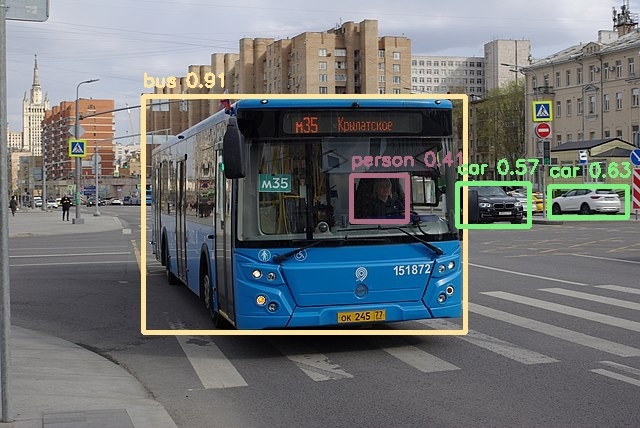

# Efficientdet-lite0

## Introduction

EfficientDets [2] are a family of object detection models. It is developed based on the advanced EfficientNet backbone and use a single
compound scaling factor. Paper proposes BiFPN - a bi-directional feature network enhanced with fast normalization.

This example uses EfficientDet-lite0 - lightweight and mobile-size version.

## Model Information

 Information          | Value                                                                                                                                            
----------------------|--------------------------------------------------------------------------------------------------------------------------------------------------
 Input shape          | RGB image (320, 320, 3)                                                                                                                          
 Input example        |  ([Image source](https://commons.wikimedia.org/wiki/File:Moscow_bus_151872_2022-05.jpg), Public domain) 
 Output shape         | Multiple tensors with sizes: (1, 25, 4), (1, 25), (1, 25), (1,)                                                                                  
 Output example       |                                                                                                        
 FLOPS                | 1.9G                                                                                                                                             
 Number of parameters | 3.2M                                                                                                                                             
 Source framework     | TensorFlow                                                                                                                                       
 Target platform      | MPUs                                                                                                                                             

## Version and changelog

Initial release of quantized int8 model.

## Tested configurations

The quantized int8 models have been tested on i.MX 8M Plus and i.MX 93 using benchmark-model (
see [i.MX Machine Learning User Guide](https://www.nxp.com/docs/en/user-guide/IMX-MACHINE-LEARNING-UG.pdf)).

## Training and evaluation

The model has been trained and evaluated on the COCO dataset [1]. It achieved a score of 26.41 mAP on the test set
according to [source Github](https://github.com/google/automl/tree/master/efficientdet).

## Conversion/Quantization

The model is downloaded from Kaggle and is already quantized.

## Use case and limitations

This model can be used for fast object detection on 320x320 pixel images.
It is not the most accurate model, but it is enough for many applications.

## Download and run

To create the TensorFlow Lite model fully quantized in int8 with float32 input and output, follow the top-level README instructions to install Docker and build the Docker image, then run the following command: 

    docker run --rm -v "$PWD:/workspace" nxp-model-zoo recipe.sh

The TensorFlow Lite model file for i.MX 8M Plus and i.MX 93 CPU is `efficientdet-lite0_quant_int8.tflite`.

**Note:** BSP >= LF6.1.36_2.1.0 supports Ethos-U Delegate on the i.MX93, which implements vela compilation online. If
using an older BSP version, please compile the quantized TFLite model with Vela compiler before being used. Download
Vela from [nxp-imx GitHub](https://github.com/nxp-imx/ethos-u-vela) from a branch, that corresponds with BSP version
used.

An example of how to use the model is in `example.py`.

## Origin

[1] Lin, Tsung-Yi, et al. "Microsoft coco: Common objects in context." European conference on computer vision. Springer,
Cham, 2014.

[2] Tan, Mingxing, Ruoming Pang, and Quoc V. Le. "Efficientdet: Scalable and efficient object detection." Proceedings of
the IEEE/CVF conference on computer vision and pattern recognition. 2020.

