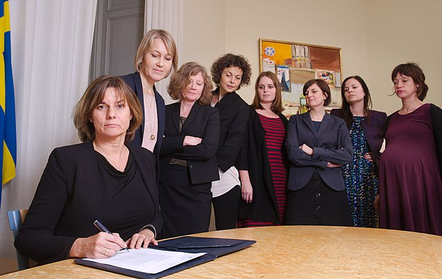
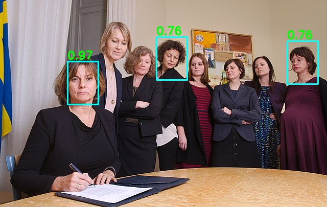

# YOLO Face Detection

## Introduction

"YOLO Face" is a lightweight face detection model designed for MCU platforms. The model is implemented based on the YOLO
algorithm, consisting of a backbone network and detection heads, and it borrows the training method from YOLOV3 [2]. The
model outputs three-dimensional vectors that can detect objects of large, medium, and small scales.

This model was developed in NXP Semiconductors.

## Model Information

| Information      | Value                                                                                                                                                                          |
|:-----------------|:-------------------------------------------------------------------------------------------------------------------------------------------------------------------------------|
| Input shape      | RGB image (160, 128, 3)                                                                                                                                                        |
| Input example    |  (Image source: [Public domain image](https://commons.wikimedia.org/wiki/File:Isabella_L%C3%B6vin_signing_climate_law_referral.jpg), license CC0 1.0 DEED |   
| Output shape     | (4,5,18),(8,10,18),(16,20,18)                                                                                                                                                  |
| Output example   |                                                                                                                                                         |
| Parameters       | 189,654                                                                                                                                                                        |
| File size        | 287KB int8 quantized                                                                                                                                                           |
| Ram usage        | 195KB int8 quantized                                                                                                                                                           |
| Source framework | TensorFlow Lite                                                                                                                                                                |
| Target platform  | MCU, MPU                                                                                                                                                                       |

## Version and changelog

Initial release of quantized int8 TFLite model.

## Tested configurations

The int8 model has been tested on MCXN947 BRK board and i.MX RT 1060 EVK using TensorFlow Lite Micro.

## Evaluation

The model hase been trained and evaluated on WiderFace dataset. It achieved scores of mAP 0.53 on the easy sets.

## Use case and limitations

The model can be used for fast face detection on low-cost MCU platforms.

## Performance

Here are performance figures evaluated on i.MX 8MP and i.MX 93 using BSP LF6.1.36_2.1.0 and for MCXN947 BRK and i.MX RT
1060 EVK using TFLite Micro framework:

| Model | Average latency |     Platform     |     Accelerator      | Command                                                                                        |
|:-----:|:---------------:|:----------------:|:--------------------:|------------------------------------------------------------------------------------------------|
| Int8  |    12.138 ms    |   i.MX 8M Plus   |    CPU (1 thread)    | benchmark_model --graph=yolo_face_detect.tflite                                                |   
| Int8  |    4.995 ms     |   i.MX 8M Plus   |   CPU (4 threads)    | benchmark_model --graph=yolo_face_detect.tflite --num_threads=4                                |  
| Int8  |    1.128 ms     |   i.MX 8M Plus   |         NPU          | benchmark_model --graph=yolo_face_detect.tflite --external_delegate_path=libvx_delegate.so     | 
| Int8  |    6.095 ms     |     i.MX 93      |    CPU (1 thread)    | benchmark_model --graph=yolo_face_detect.tflite                                                |
| Int8  |     143 ms      |     i.MX 93      |   CPU (2 threads)    | benchmark_model --graph=yolo_face_detect.tflite --num_threads=2                                |
| Int8  |    0.556 ms     |     i.MX 93      |         NPU          | benchmark_model --graph=yolo_face_detect.tflite --external_delegate_path=libethosu_delegate.so |
| int8  |      25ms       |   MCXN947 BRK    |         NPU          | TFLite Micro                                                                                   |
| int8  |      272ms      | i.MX RT 1060 EVK | CPU(600M Cortext M7) | TFLite Micro                                                                                   |

**Note**: Refer to the [User Guide](https://www.nxp.com/docs/en/user-guide/IMX-MACHINE-LEARNING-UG.pdf), to find out where
benchmark_model, libvx_delegate and libethosu_delegate are located.

## Run

### Requirements

For requirements see `requirements.txt` file or install with pip:

```
pip install -r requirements.txt
```

### How to Run

The TFLite model file for i.MX 8M Plus and for i.MX 93 is `*.tflite`.

**Note:** BSP >= LF6.1.36_2.1.0 supports Ethos-U Delegate on the i.MX93, which implements vela compilation online. If using an older BSP version, please compile the quantized TFLite model with Vela compiler before being used. Download Vela from [nxp-imx GitHub](https://github.com/nxp-imx/ethos-u-vela) from a branch, that corresponds with BSP version used.

example.py support detection from a static image or a camera of users laptop.

```
python example.py -image xxx.jpg 
(default is test.jpg)
```

Input image:


Output image:


or

```
python example.py -video
```

## Reference

https://github.com/qqwweee/keras-yolo3

[1] WIDERface dataset: Yang, Shuo, et al. "Wider face: A face detection benchmark." Proceedings of the IEEE conference
on
computer vision and pattern recognition. 2016.

[2] Redmon, Joseph, and Ali Farhadi. "Yolov3: An incremental improvement." arXiv preprint arXiv:1804.02767 (2018).
