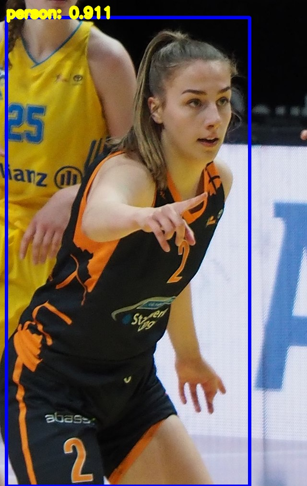

# FastestDet Person Detection

## Introduction

"FastestDet" [1] is an anchorless object detection model consisting of a ShuffleNetV2 [2] backbone and a fully convolutional detection head. The model included in this repository is trained for person detection (using the PASCAL-VOC dataset) and was optimized to achieve optimal performance on NXP's i.MXRT1170.

## Model Information

| Information      | Value                                                                                                                                                                          |
|:-----------------|:-------------------------------------------------------------------------------------------------------------------------------------------------------------------------------|
| Input shape      | RGB image (220, 220, 3)                                                                                                                                                        |
| Input example    | (Image source: [Public domain image](https://commons.wikimedia.org/wiki/File:Monika_Crnjak_(Rhein-Main_Baskets)_2022-04-15_(cropped)_2.jpg), Creative Commons Attribution-Share Alike 4.0 International) |   
| Output shape     | (14, 14, 6)                                                                                                                                                  |
| Output example   |                                                                                                                                                         |
| Parameters       | 152.9K                                                                                                                                                            |
| File size        | 315 KB (INT8)                                                                                                                                             |
| Ram usage        | 600 KB (INT8)                                                                                                                                                           |
| Source framework | TFLite                                                                                                                                                                |
| Target platform  | MCU                                                                                                                                                                       |

## Version and changelog

- Initial release of FastestDet person detection model for i.MXRT1170.

## Tested configurations

The model has been tested on i.MXRT1170 EVK using TFLite micro for quantization and deployment.

## Evaluation

The model has been trained and evaluated on the Pascal VOC 2012 dataset [3], only for the persons class. It achieves a score of `0.5736 % AP @[IoU=0.50]` (INT8).

```
 Average Precision  (AP) @[ IoU=0.50:0.95 | area=   all | maxDets=100 ] = 0.265
 Average Precision  (AP) @[ IoU=0.50      | area=   all | maxDets=100 ] = 0.574
 Average Precision  (AP) @[ IoU=0.75      | area=   all | maxDets=100 ] = 0.212
 Average Precision  (AP) @[ IoU=0.50:0.95 | area= small | maxDets=100 ] = 0.017
 Average Precision  (AP) @[ IoU=0.50:0.95 | area=medium | maxDets=100 ] = 0.258
 Average Precision  (AP) @[ IoU=0.50:0.95 | area= large | maxDets=100 ] = 0.504
 Average Recall     (AR) @[ IoU=0.50:0.95 | area=   all | maxDets=  1 ] = 0.213
 Average Recall     (AR) @[ IoU=0.50:0.95 | area=   all | maxDets= 10 ] = 0.351
 Average Recall     (AR) @[ IoU=0.50:0.95 | area=   all | maxDets=100 ] = 0.358
 Average Recall     (AR) @[ IoU=0.50:0.95 | area= small | maxDets=100 ] = 0.046
 Average Recall     (AR) @[ IoU=0.50:0.95 | area=medium | maxDets=100 ] = 0.386
 Average Recall     (AR) @[ IoU=0.50:0.95 | area= large | maxDets=100 ] = 0.606
```

## Use case and limitations

The model can be used for person detection on MCU platforms.

## Performance

Below are the performance figures of the model evaluated on i.MX RT 1170 EVK using TensorFlow Lite Micro:

| Model | Average latency |     Platform     |     Accelerator      | Command                                                                                        |
|:-----:|:---------------:|:----------------:|:--------------------:|------------------------------------------------------------------------------------------------|
| int8  |      200 ms      | i.MX RT 1170 EVK | CPU (1 GHz Cortex M7) | TFLite Micro                                                                                           |


## Run

> ***Note :*** This has been tested using Python3.8 on Ubuntu 20.04.6 LTS.

This guide is written for Linux.

### Example for x86

To facilitate the usage and the development of an application using this model, we provide the `example.py` script which shows how this model can be used for inferencing on an x86 host.

Install a virtual environment following:

```
python3.8 -m venv virtual_env
source virtual_env/bin/activate
pip install --upgrade pip setuptools wheel
pip install -r requirements.txt
```

Then, simply run the following command, to inference on `test.jpg`

```
python example.py
```

or the following command to inference on a video device (e.g., a webcam)

```
python example.py --video
```

## Reference

[1] https://github.com/dog-qiuqiu/FastestDet

[2] Ma, Ningning, et al. "Shufflenet v2: Practical guidelines for efficient cnn architecture design." Proceedings of the European conference on computer vision (ECCV). 2018.

[3] Everingham, Mark, et al. "The pascal visual object classes (voc) challenge." International journal of computer vision 88 (2010): 303-338.
