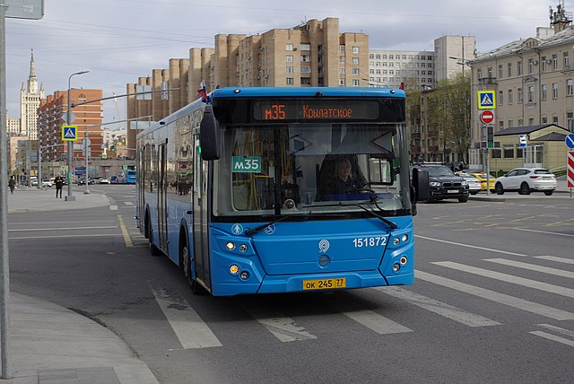
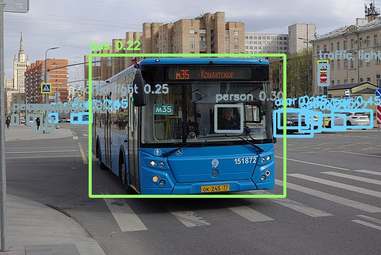

# SSDLite MobileNetV2

## Introduction

["SSDLite MobileNetV2"](https://github.com/tensorflow/models/blob/master/research/object_detection/g3doc/tf1_detection_zoo.md) is a lightweight object detection model designed to run in real time on mobile devices. It is based on the MobileNetV2 [2] backbone and the SSD architecture [3]. The standard SSD convolutions are replaced with depthwise-separable convolutions, hence SSDLite.
The model regresses bounding boxes (4 coordinates) and a confidence score for each box. The bounding box decoding and non-maximum suppression (NMS) steps are NOT included in the model.
Please look at `example.py` for an example of implementation of box decoding and NMS.

## Model Information

Information   | Value
---           | ---
Input shape   | RGB image (300, 300, 3)
Input example |  ([Image source](https://commons.wikimedia.org/wiki/File:Moscow_bus_151872_2022-05.jpg), Public domain)
Output shape  | Tensor of size (1917, 1, 4) containing bounding box coordinates (not decoded). Tensor of size (1917, 91) containing class scores for each box.
Output example | 
FLOPS | 1.5G
Number of parameters | 4.3M
File size (int8) | 5.4M
Source framework | TensorFlow 1
Target platform | MPUs

## Version and changelog

Initial release of quantized int8 model.

## Tested configurations

The int8 model has been tested on i.MX 8MP and i.MX 93 (BSP LF6.1.22_2.0.0) using benchmark-model.

## Training and evaluation

The model has been trained and evaluated on the [COCO dataset](https://cocodataset.org/) [1], which features 80 classes.
The floating point model achieved a score of 22mAP on the test set, according to [the source of the model](https://github.com/tensorflow/models/blob/master/research/object_detection/g3doc/tf1_detection_zoo.md).
Using the `evaluate.py` script, we evaluate the int8 quantized model on the validation set and obtain 16.4mAP.

The instructions for re-training the model (e.g. on different data) can be found in the [TensorFlow Detection Model Zoo](https://github.com/tensorflow/models/blob/master/research/object_detection/g3doc/tf1_training_and_evaluation.md).

## Conversion/Quantization

The original model is converted from TensorFlow 1 to TensorFlow Lite.
The pre and post-processing steps are removed from the original model before quantization.

The conversion script performs this conversion and outputs the int8 quantized model.
100 random images from the COCO 2017 validation dataset are used as calibration for the quantization.

## Use case and limitations

This model can be used for fast object detection on 300x300 pixel images.
It is not the most accurate model, but it is enough for many applications.

## Performance

Here are performance figures evaluated on i.MX 8M Plus and i.MX 93 (BSP LF6.1.22_2.0.0):

Model   | Average latency  | Platform     | Accelerator       | Command
---     | ---              | ---          | ---               | ---
Int8    | 252ms            | i.MX 8M Plus |   CPU (1 thread)  | /usr/bin/tensorflow-lite-2.10.0/examples/benchmark_model --graph=ssdlite-mobilenetv2.tflite
Int8    | 70.9ms           | i.MX 8M Plus |   CPU (4 threads) | /usr/bin/tensorflow-lite-2.10.0/examples/benchmark_model --graph=ssdlite-mobilenetv2.tflite --num_threads=4
Int8    | 17.0ms           | i.MX 8M Plus |   NPU             | /usr/bin/tensorflow-lite-2.10.0/examples/benchmark_model --graph=ssdlite-mobilenetv2.tflite --external_delegate_path=/usr/lib/libvx_delegate.so
Int8    | 104ms            | i.MX 93      |   CPU (1 thread)  | /usr/bin/tensorflow-lite-2.10.0/examples/benchmark_model --graph=ssdlite-mobilenetv2.tflite
Int8    | 61.1ms           | i.MX 93      |   CPU (2 threads) | /usr/bin/tensorflow-lite-2.10.0/examples/benchmark_model --graph=ssdlite-mobilenetv2.tflite --num_threads=2
Int8    | 10.0ms           | i.MX 93      |   NPU             | /usr/bin/tensorflow-lite-2.10.0/examples/benchmark_model --graph=ssdlite-mobilenetv2_vela.tflite --external_delegate_path=/usr/lib/libethosu_delegate.so

## Download and run

To create the TensorFlow Lite model fully quantized in int8 with float32 input and output, run:

    bash recipe.sh

The TensorFlow Lite model file for i.MX 8M Plus and i.MX 93 CPU is `ssdlite-mobilenetv2.tflite`. The model for i.MX 93 NPU will be in `model_imx93`.

An example of how to use the model is in `example.py`.

## Origin

Model implementation: https://github.com/tensorflow/models/blob/master/research/object_detection/g3doc/tf1_detection_zoo.md

[1] Lin, Tsung-Yi, et al. "Microsoft coco: Common objects in context." European conference on computer vision. Springer, Cham, 2014.

[2] Sandler, Mark, et al. "Mobilenetv2: Inverted residuals and linear bottlenecks." Proceedings of the IEEE conference on computer vision and pattern recognition. 2018. 

[3] Liu, Wei, et al. "Ssd: Single shot multibox detector." Computer Vision–ECCV 2016: 14th European Conference, Amsterdam, The Netherlands, October 11–14, 2016, Proceedings, Part I 14. Springer International Publishing, 2016.
