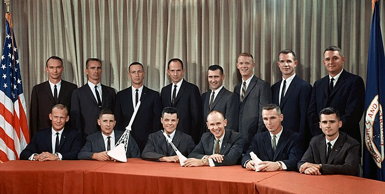
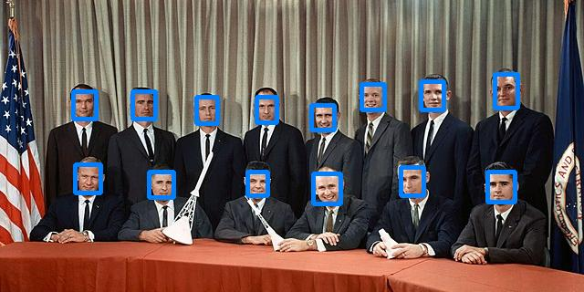

# Ultraface slim

## Introduction

["Ultraface"](https://github.com/Linzaer/Ultra-Light-Fast-Generic-Face-Detector-1MB) is a lightweight face detection model designed for edge computing devices.
It regresses bounding boxes (4 coordinates) and a confidence score for each box. The bounding box decoding and non-maximum suppression steps are included in the model.

NB: This is only a face detection model. It does not perform face recognition/identification.

## Model Information

Information   | Value
---           | ---
Input shape   | RGB image (320, 240, 3)
Input example |  (Image source: NASA, Public domain)
Output shape  | Tensor of size (100, 6) containing a maximum of 100 detected faces.
Output example | 
FLOPS | 168,707,432
Number of parameters | 264,732
File size (float32) | 1.04MB
File size (int8) | 403KB
Source framework | Pytorch
Target platform | MPUs, MCUs

## Version and changelog

Initial release of float32 and quantized int8 model.

## Tested configurations

The int8 model has been tested on i.MX 8MP and i.MX 93 using benchmark-model (see [i.MX Machine Learning User Guide](https://www.nxp.com/docs/en/user-guide/IMX-MACHINE-LEARNING-UG.pdf)) and on i.MX RT 1170 and i.MX RT 1050 using TensorFlow Lite Micro.

## Training and evaluation

The model has been trained and evaluated on the Widerface dataset. It achieved scores of 0.77/0.671/0.395 on the easy/medium/hard sets, according to [the source of the model](https://github.com/Linzaer/Ultra-Light-Fast-Generic-Face-Detector-1MB).

## Conversion/Quantization

The original model is converted from PyTorch to TensorFlow, and then to TensorFlow Lite.

The conversion script performs this conversion and outputs the float32 model and int8 quantized model. 100 random images from the Widerface test dataset are used as calibration for the quantization.

## Use case and limitations

This model can be used for very fast face detection on 320x240 pixel images.

## Download and run

To create the TensorFlow Lite model fully quantized in int8 with int8 input and float32 output, follow the top-level README instructions to install Docker and build the Docker image, then run the following command: 

    docker run --rm -v "$PWD:/workspace" nxp-model-zoo recipe.sh

The TensorFlow Lite model file for i.MX 8M Plus and i.MX RT 1170 is `ultraface_slim_uint8_float32.tflite`. The file for i.MX RT 1170 and 1050 is `ultraface_slim_int8.tflite`. The file for i.MX 93 is in the `model_imx93` directory.

An example of how to use the model is in `example.py`.

## Origin

Model implementation: https://github.com/Linzaer/Ultra-Light-Fast-Generic-Face-Detector-1MB

[1] WIDERface dataset: Yang, Shuo, et al. "Wider face: A face detection benchmark." Proceedings of the IEEE conference on computer vision and pattern recognition. 2016.
