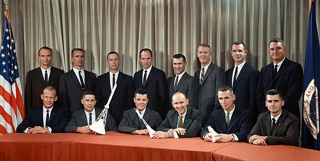

# Ultraface "ultraslim"

## Introduction

["Ultraface"](https://github.com/Linzaer/Ultra-Light-Fast-Generic-Face-Detector-1MB) is a lightweight face detection model designed for edge computing devices.
It regresses bounding boxes (4 coordinates) and a confidence score for each box. The bounding box decoding and non-maximum suppression steps are included in the model.

This "ultraslim" version is a cut-down version of the original model to run it on systems with very low amounts of memory. Here are the modifications (details in `ultraslim.patch`):
- Input resolution set to 128x128 instead of 320x240
- Removed non-maximum suppression operator
- Removed finest output level 

NB: This is only a face detection model. It does not perform face recognition/identification.

## Model Information

Information   | Value
---           | ---
Input shape   | RGB image (128, 128, 3)
Input example |  (Image source: NASA, Public domain)
Output shape  | Tensor of size (172, 6) containing the raw output of the three coarsest output levels. See `example.py` to decode this output.
Output example | 
FLOPS | 34.5M (given by keras_flops)
Number of parameters | 262,282
File size (int8) | 375KB
Source framework | Pytorch
Target platform | MCUs

## Version and changelog

Initial release of quantized int8 model.

## Tested configurations

The int8 model has been tested on MCX-N947 using TensorFlow Lite Micro.

## Training and evaluation

The model has been trained and evaluated on the Widerface dataset. It achieved scores of 0.77/0.671/0.395 on the easy/medium/hard sets, according to [the source of the model](https://github.com/Linzaer/Ultra-Light-Fast-Generic-Face-Detector-1MB).

## Conversion/Quantization

The original model is converted from PyTorch to TensorFlow, and then to TensorFlow Lite.

The conversion script performs this conversion and outputs the int8 quantized model. 100 random images from the Widerface test dataset are used as calibration for the quantization.

## Use case and limitations

This model can be used for very fast face detection on 128x128 pixel images. Since the finest output level was removed, the model will not be able to detect very small faces.

## Download and run

To create the TensorFlow Lite model fully quantized in int8 with int8 input and float32 output, follow the top-level README instructions to install Docker and build the Docker image, then run the following command: 

    docker run --rm -v "$PWD:/workspace" nxp-model-zoo recipe.sh

The generated TensorFlow Lite model file is `ultraface_ultraslim_int8.tflite`.

An example of how to use the model is in `example.py`.

## Origin

Model implementation: https://github.com/Linzaer/Ultra-Light-Fast-Generic-Face-Detector-1MB

[1] WIDERface dataset: Yang, Shuo, et al. "Wider face: A face detection benchmark." Proceedings of the IEEE conference on computer vision and pattern recognition. 2016.
