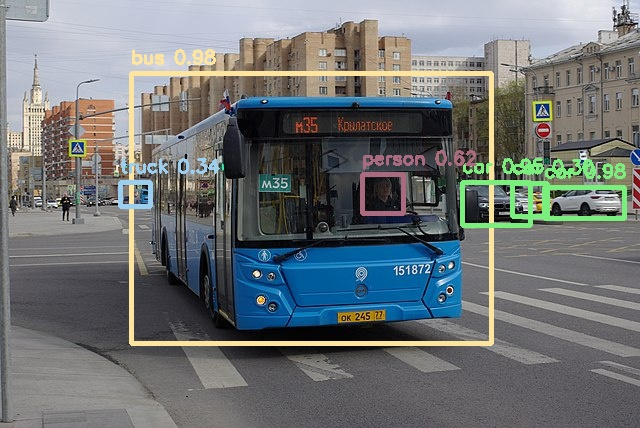

# YOLOv4-tiny

## Introduction

YOLO (You Only Look Once) is a series of object detection models designed for fast inference, which makes them well suited for edge devices.

YOLOv4 [2] was released in 2020 and provides many small improvements over YOLOv3 [3]. These improvements add up to create a more precise network at the same speed.

The model regresses bounding boxes (4 coordinates) and a confidence score for each box. The bounding box decoding and non-maximum suppression (NMS) steps are NOT included in the model.
Please look at `example.py` for an example of implementation of box decoding and NMS.

## Model Information

Information   | Value
---           | ---
Input shape   | RGB image (416, 416, 3)
Input example |  ([Image source](https://commons.wikimedia.org/wiki/File:Moscow_bus_151872_2022-05.jpg), Public domain)
Output shape  | Tensors of size (26, 26, 255) and (13, 13, 255) containing bounding box coordinates (not decoded) and class scores for two resolution levels and 3 anchor boxes per cell. More information in `example.py`.
Output example | 
FLOPS | 6.9G
Number of parameters | 6.05M
File size (int8) | 5.9M
Source framework | DarkNet
Target platform | MPUs

## Version and changelog

Initial release of quantized int8 and float32 models.

## Tested configurations

The int8 model has been tested on i.MX 8MP and i.MX 93 (BSP LF6.1.22_2.0.0) using benchmark-model.

## Training and evaluation

The model has been trained and evaluated on the [COCO dataset](https://cocodataset.org/) [1], which features 80 classes.
The floating point model achieved a score of 40mAP@0.5IoU on the test set, according to [the source of the model](https://github.com/AlexeyAB/darknet/).
Using the `evaluate.py` script, we evaluate the int8 quantized model on the validation set and obtain 33mAP@0.5IoU.

Instructions to re-train the network can be found [in the original repository](https://github.com/AlexeyAB/darknet/)

## Conversion/Quantization

The original model is converted from the DarkNet framework to TensorFlow Lite.

The `export_model.py` conversion script performs this conversion and outputs the int8 quantized model and float32 model.
100 random images from the COCO 2017 validation dataset are used as calibration for the quantization.

## Use case and limitations

This model can be used for fast object detection on 416x416 pixel images.
It is not the most accurate model, but it is enough for many applications.
We noticed that the model performs well for large objects but has issues will small objects.
This is probably due to the fact that it only features two output levels instead of three for larger models.

## Download and run

To create the TensorFlow Lite model fully quantized in int8 with int8 input and float32 output and the float32 model, follow the top-level README instructions to install Docker and build the Docker image, then run the following command: 

    docker run --rm -v "$PWD:/workspace" nxp-model-zoo recipe.sh

The TensorFlow Lite model file for i.MX 8M Plus and i.MX 93 CPU is `yolov4-tiny_416_quant.tflite`. The model for i.MX 93 NPU will be in `model_imx93`.

The 32-bit floating point model is `yolov4-tiny_416_float32.tflite`.

An example of how to use the model is in `example.py`.

## Origin

Model implementation: https://github.com/AlexeyAB/darknet/

[1] Lin, Tsung-Yi, et al. "Microsoft coco: Common objects in context." European conference on computer vision. Springer, Cham, 2014.

[2] Bochkovskiy, Alexey, Chien-Yao Wang, and Hong-Yuan Mark Liao. "Yolov4: Optimal speed and accuracy of object detection." arXiv preprint arXiv:2004.10934 (2020).

[3] Redmon, Joseph, and Ali Farhadi. "Yolov3: An incremental improvement." arXiv preprint arXiv:1804.02767 (2018).