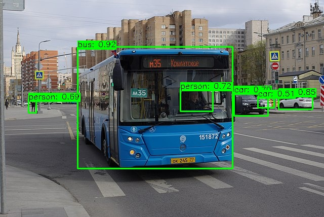

# YOLOv5-m

## Introduction

Yolov5 is a state-of-the-art computer vision model and the fifth iteration of the revolutionary "You Only Look Once" object detection model. The model can be used for object detection, classification and segmentation tasks. This repository contains model for object detection task.

YOLOv5 is designed to deliver high-speed, high-accuracy results in real-time. Built on PyTorch, it is versatile and user-friendly, making it suitable for various computer vision projects. [2]

This model was developed by Ultralytics and is released under AGPL-3.0 license for open source purposes. In case, one
would like to use the model for commercial purpose, refer to [Ultralytics Enterprise license](https://www.ultralytics.com/license).

The source of the model used in eIQ Model Zoo is from [Ultralytics Yolov5 repository](https://github.com/ultralytics/yolov5.git).

The model is released under different sizes: Yolov5n, Yolov5s. Yolov5m, Yolov5l and Yolov5x. This repository contains information about Yolov5m.

## Model Information

 Information          | Value                                                                                                                                            
----------------------|--------------------------------------------------------------------------------------------------------------------------------------------------
 Input shape          | Color image (1, 3, 640, 640)                                                                                                                        
 Input example        |  ([Image source](https://commons.wikimedia.org/wiki/File:Moscow_bus_151872_2022-05.jpg), Public domain) 
 Output shape         | Tensor of size (1, 25200, 85)                                              
 Output example       |                                                                                                        
 FLOPS                | 49.0G                                                                                                                                         
 Number of parameters | 21.2M                                                                                                                                             
 Source framework     | Pytorch                                                                                                                                          
 Target platform      | MPUs                                                                                                                                         

## Version and changelog

Initial release of quantized int8 model.

## Tested configurations

The quantized int8 models have been tested on i.MX 8M Plus and i.MX 93 using benchmark-model (see [i.MX Machine Learning User Guide](https://www.nxp.com/docs/en/user-guide/IMX-MACHINE-LEARNING-UG.pdf)).

## Training and evaluation

The model has been trained and evaluated on the COCO dataset. It achieved a score of 45.4 mAP on the test set according to [the documentation](https://github.com/ultralytics/yolov5/releases/).

The original training procedure is detailed [here](https://github.com/ultralytics/yolov5/blob/master/train.py).

Training can also be done using the following command which is part of [Ultralytics Yolov5 repository](https://github.com/ultralytics/yolov5):
```bash
python train.py --data coco.yaml --epochs 300 --weights '' --cfg yolov5m.yaml  --batch-size 128
```

## Conversion/Quantization

The model is downloaded in the PyTorch format through Ultralytics module. Using Ultralytics command line application, model is converted and fully quantized into tflite format. For more details, please refer to the [source code of the model](https://github.com/ultralytics/yolov5).

## Use case and limitations

This model can be used for object detection applications.

## Download and run

[//]: # (To create the TFLite model fully quantized in int8 with int8 input and int8 output, run `bash recipe.sh`.)

### Optimized model for full integer quantization

#### How to get model

0. Note, that model is released under AGPL 3.0 license
1. visit [Ultralyrics Yolov5 repository](https://github.com/ultralytics/yolov5) and clone it
2. install all necessary dependencies
3. run following command to create fully quantized int8 model with separate outputs

```bash
python export.py --weights yolov5m.pt --include tflite --int8
```

4. The TFLite model file for i.MX 8M Plus and for i.MX 93 is `yolov5m-int8.tflite` located in the `yolov5m` directory.

**Note:** BSP >= LF6.1.36_2.1.0 supports Ethos-U Delegate on the i.MX93, which implements vela compilation online. If using an older BSP version, please compile the quantized TFLite model with Vela compiler before being used. Download Vela from [nxp-imx GitHub](https://github.com/nxp-imx/ethos-u-vela) from a branch, that corresponds with BSP version used.

#### Inference

Use following command to run inference:

````bash
python detect.py --weights yolov5m.pt --source 'https://ultralytics.com/images/bus.jpg'
````

For running inference with tflite model:
````bash
python detect.py --weights yolov5m-int8.tflite --source 'https://ultralytics.com/images/bus.jpg'
````

Result is saved into /runs/detect/ directory.


## Origin

[1] Original model implementation by Glenn Jocher: https://github.com/ultralytics/yolov5

[2] Model documentation: https://docs.ultralytics.com/yolov5/

[3] Dataset: https://cocodataset.org/#home
