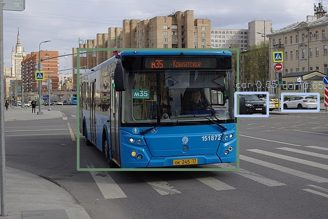

# YOLOv8

## Introduction

Yolov8 is a state-of-the-art computer vision model, built upon previous Yolo models. The model can be used for object
detection, classification and segmentation tasks. This repository contains model for object detection task.

Yolov8 is built on the Yolov5 model. Compared to Yolov5, Yolov8 comes with a new anchor-free detection system, changes
to the convolutional blocks in the model and mosaic augmentation during training. [2]

This model was developed by Ultralytics and is released under AGPL-3.0 license for open source purposes. In case, one
would like to use the model for commercial purpose, refer
to [Ultralytics Enterprise license](https://www.ultralytics.com/license).

The source of the model used in eIQ Model Zoo is from company DeGirum
and [their fork](https://github.com/DeGirum/ultralytics_yolov8) of Ultralytics repository [3].

## Model Information

 Information          | Value                                                                                                                                            
----------------------|--------------------------------------------------------------------------------------------------------------------------------------------------
 Input shape          | Color image (640, 640, 3)                                                                                                                        
 Input example        |  ([Image source](https://commons.wikimedia.org/wiki/File:Moscow_bus_151872_2022-05.jpg), Public domain) 
 Output shape         | 6 outputs: (1, 6400, 64), (1, 6400, 80), (1, 400, 80), (1, 1600, 64), (1, 400, 64), (1, 1600, 80)                                                
 Output example       |                                                                                                        
 FLOPS                | 8.7 MOPS                                                                                                                                         
 Number of parameters | 3.2M                                                                                                                                             
 Source framework     | Pytorch                                                                                                                                          
 Target platform      | MPU, MCU                                                                                                                                         

## Version and changelog

Initial release of quantized int8 model.

## Tested configurations

The quantized int8 models have been tested on i.MX 8M Plus and i.MX 93 using benchmark-model (
see [i.MX Machine Learning User Guide](https://www.nxp.com/docs/en/user-guide/IMX-MACHINE-LEARNING-UG.pdf)).

## Training and evaluation

The model has been trained and evaluated on the COCO dataset. It achieved a score of 37.3 mAP on the test set according
to [the documentation](https://docs.ultralytics.com/datasets/detect/coco/).

The original training procedure is
detailed [here](https://github.com/ultralytics/ultralytics/blob/main/ultralytics/engine/trainer.py).

## Conversion/Quantization

The model is downloaded in the PyTorch format through Ultralytics module. Using Ultralytics command line application,
model is converted and fully quantized into tflite format. For more details, please refer to
the [source code of the model](https://github.com/ultralytics/ultralytics/tree/main).

## Use case and limitations

This model can be used for object detection applications.

## Performance

Here are performance figures evaluated on i.MX 8MP using BSP 6.6.23:

 Model | Average latency | Platform     | Accelerator     | Command                                                                                               
-------|-----------------|--------------|-----------------|-------------------------------------------------------------------------------------------------------
 Int8  | 1148 ms         | i.MX 8M Plus | CPU (1 thread)  | benchmark_model --graph=yolov8n_full_integer_quant.tflite                                             
 Int8  | 447 ms          | i.MX 8M Plus | CPU (4 threads) | benchmark_model --graph=yolov8n_full_integer_quant.tflite --num_threads=4                             
 Int8  | 51 ms           | i.MX 8M Plus | NPU             | benchmark_model --graph=yolov8n_full_integer_quant.tflite --external_delegate_path=libvx_delegate.so  
 Int8  | 500 ms          | i.MX 93      | CPU (1 thread)  | benchmark_model --graph=yolov8n_full_integer_quant.tflite                                             
 Int8  | 359 ms          | i.MX 93      | CPU (2 threads) | benchmark_model --graph=yolov8n_full_integer_quant.tflite --num_threads=2                             
 Int8  | 56 ms           | i.MX 93      | NPU             | benchmark_model --graph=yolov8n_full_integer_quant.tflite --external_delegate_path=ethosu_delegate.so 

Note: Refer to the [User Guide](https://www.nxp.com/docs/en/user-guide/IMX-MACHINE-LEARNING-UG.pdf), to find out where
benchmark_model, libvx_delegate and libethosu_delegate are located.

## Download and run

[//]: # (To create the TFLite model fully quantized in int8 with int8 input and int8 output, run `bash recipe.sh`.)

### Optimized model for full integer quantization

#### How to get model

0. Note, that model is released under AGPL 3.0 license
1. visit [DeGirum's GitHub repository](https://github.com/DeGirum/ultralytics_yolov8) and clone it
2. install all necessary dependencies
3. run following command to create fully quantized int8 model with separate outputs

```bash
yolo export model=yolov8n.pt imgsz=640 format=tflite int8 separate_outputs=True
```

4. The TFLite model file for i.MX 8M Plus and for i.MX 93 is `yolov8n_full_integer_quant.tflite` located in
   the `yolov8n_saved_model` directory.

**Note:** BSP >= LF6.1.36_2.1.0 supports Ethos-U Delegate on the i.MX93, which implements vela compilation online. If
using an older BSP version, please compile the quantized TFLite model with Vela compiler before being used. Download
Vela from [nxp-imx GitHub](https://github.com/nxp-imx/ethos-u-vela) from a branch, that corresponds with BSP version
used.

#### Inference

An example of how to use the model is located
on [DeGirum's github repository: yolo_inference](https://github.com/DeGirum/yolo_inference/tree/master).

### Original model

#### How to get model

0. Check license options at Ultralytics page - AGPL 3.0 or commercial
1. install package with following command:

```bash
pip install ultralytics
```

2. get int8 quantized tflite model with following command:

```bash
yolo export model=yolov8n.pt imgsz=640 format=tflite int8
```

3. The TFLite model file for i.MX 8M Plus and for i.MX 93 is `yolov8n_full_integer_quant.tflite` located in
   the `yolov8n_saved_model` directory.

#### Inference

Use following command to run inference:

````bash
yolo detect predict model=./yolov8n_saved_model/yolov8n_full_integer_quant.tflite source='https://ultralytics.com/images/bus.jpg'
````

Result is saved into /runs/detect/predic directory.

## Origin

[1] Original model implementation: https://github.com/ultralytics/ultralytics

[2] Model documentation: https://docs.ultralytics.com/

[3] Improved model quantization by DeGirum: https://github.com/DeGirum/ultralytics_yolov8

[4] Dataset: https://cocodataset.org/#home

[5] Jocher, Glenn, and Chaurasia, Ayush and Jing Qiu. Ultralytics YOLOv8. 8.0.0,
2023, https://github.com/ultralytics/ultralytics
