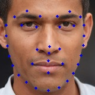

# facial-landmarks-35-adas-0002

## Introduction

[facial-landmarks-35-adas-0002](https://docs.openvino.ai/2022.3/omz_models_model_facial_landmarks_35_adas_0002.html) is a neural network for regression of face landmarks positions, created and released by Intel as part of the [OpenVino Model Zoo](https://github.com/openvinotoolkit/open_model_zoo/tree/master/models/intel/facial-landmarks-35-adas-0002) and provided under Apache-2.0 license.

The network takes as input a cropped image of a person's face, and outputs the coordinates of 35 specific points on the face. The list of those points is available [at the source of the model](https://github.com/openvinotoolkit/open_model_zoo/tree/master/models/intel/facial-landmarks-35-adas-0002).

## Model Information

Information   | Value
---           | ---
Input shape   | RGB Face crop (60, 60, 3)
Input example |  (Image generated on thispersondoesnotexist.com)
Output shape  | Position of face landmarks (70,)
Output example |  (Image generated on thispersondoesnotexist.com)
FLOPS | 41.851 MOPS
Number of parameters | 4.595MParams
Source framework | Caffe
Target platform | MPUs/MCUs

## Version and changelog

Initial release of quantized int8 model.

## Tested configurations

The int8 model has been tested on i.MX 8MP and i.MX 93 using benchmark-model (see [i.MX Machine Learning User Guide](https://www.nxp.com/docs/en/user-guide/IMX-MACHINE-LEARNING-UG.pdf)).

## Training and evaluation

According to [the source of the model](https://docs.openvino.ai/2022.3/omz_models_model_facial_landmarks_35_adas_0002.html), the model has been trained on an internal dataset of 1000 images of 300 different people with various facial expressions.

More information about the accuracy metrics is available [on this page](https://docs.openvino.ai/2022.3/omz_models_model_facial_landmarks_35_adas_0002.html).

Since the training dataset is not made publicly available, we could not verify the accuracy of the final quantized model. However, it seems to yield good results.

## Conversion/Quantization

The original model is converted from OpenVino to TensorFlow Lite through the SavedModel format using [openvino2tensorflow](https://github.com/PINTO0309/openvino2tensorflow).

The conversion script performs this conversion and outputs the float32 model and int8 quantized model. 100 random images from the training dataset are used as calibration for the quantization.

## Use case and limitations

This model can be used for the following use cases:

- Confirming that a person's face is centered within a frame

- Estimating the orientation of a person's face

- Basic gaze estimation

Since the accuracy of the quantized model was not verified, this model should not be used in critical scenarios.

## Download and run

To create the TensorFlow Lite model fully quantized in int8, follow the top-level README instructions to install Docker and build the Docker image, then run the following command: 

    docker run --rm -v "$PWD:/workspace" nxp-model-zoo make

An example of how to use the model is in `example.py`.

## Origin

Model source: https://docs.openvino.ai/2022.3/omz_models_model_facial_landmarks_35_adas_0002.html