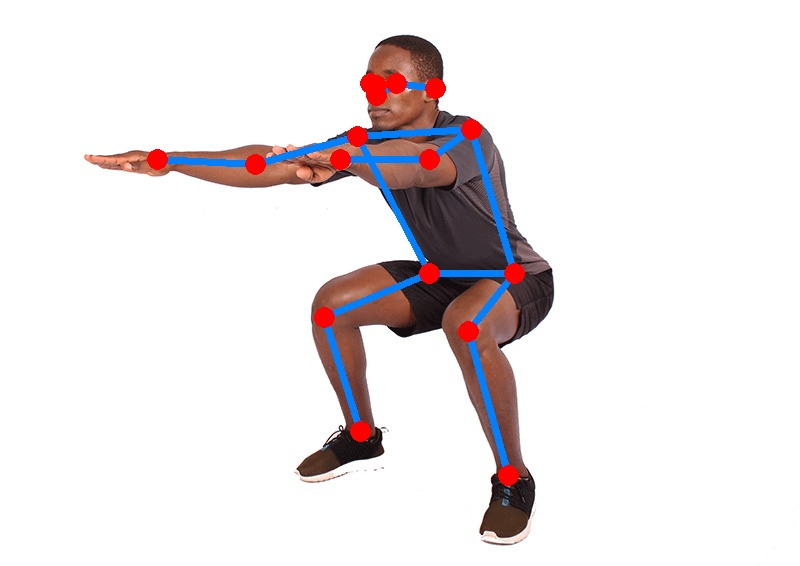

# MoveNet

## Introduction

["MoveNet"](https://blog.tensorflow.org/2021/05/next-generation-pose-detection-with-movenet-and-tensorflowjs.html) is a lightweight human pose estimation model designed to run in real time on mobile devices. Specifically, we use the single pose "Lightning" variant, which is the fastest. This model is based on a CenterNet [3] architecture, with a MobileNetV2 backbone [2] and an FPN [4].
It regresses the position and confidence score of 17 human body keypoints. 
Please look at `example.py` for an example of how to interpret the output of the model.

## Model Information

Information   | Value
---           | ---
Input shape   | RGB image (192, 192, 3)
Input example |  ([Image source](https://commons.wikimedia.org/wiki/File:Man-Doing-Air-Squats-A-Bodyweight-Exercise-for-Legs.png), Public domain)
Output shape  | Tensor of size (1, 1, 17, 3) containing keypoint coordinates (first two elements of last dimension) and confidence scores (last element of last dimension).
Output example | 
FLOPS | N/A
Number of parameters | N/A
File size (int8) | 2.8M
Source framework | TensorFlow
Target platform | MPUs

## Version and changelog

Initial release of quantized int8 model.

## Tested configurations

The int8 model has been tested on i.MX 8MP and i.MX 93 (BSP LF6.1.22_2.0.0) using benchmark-model.

## Training and evaluation

The model has been trained and evaluated by Google on the [COCO dataset](https://cocodataset.org/) [1] and the proprietary Active dataset owned by Google.

More information about the training and evaluation of the network is available in the [MoveNet Model Card](https://storage.googleapis.com/movenet/MoveNet.SinglePose%20Model%20Card.pdf).

## Conversion/Quantization

The original model is converted from TensorFlow to TensorFlow Lite by Google. We directly download the int8 quantized model from Tensorflow Hub.

## Use case and limitations

Information about the use case and limitations of this network is available in the "Intended Use" section of the [Model Card](https://storage.googleapis.com/movenet/MoveNet.SinglePose%20Model%20Card.pdf).

## Download and run

To download the TensorFlow Lite model fully quantized in int8 with int8 input and float32 output, follow the top-level README instructions to install Docker and build the Docker image, then run the following command: 

    docker run --rm -v "$PWD:/workspace" nxp-model-zoo recipe.sh

The TensorFlow Lite model file for i.MX 8M Plus and i.MX 93 CPU is `movenet.tflite`. The model for i.MX 93 NPU is in `model_imx93`.

An example of how to use the model is in `example.py`.

## Origin

Model implementation: https://github.com/RangiLyu/nanodet

[1] Lin, Tsung-Yi, et al. "Microsoft coco: Common objects in context." European conference on computer vision. Springer, Cham, 2014.

[2] Sandler, Mark, et al. "Mobilenetv2: Inverted residuals and linear bottlenecks." Proceedings of the IEEE conference on computer vision and pattern recognition. 2018.

[3] Duan, Kaiwen, et al. "Centernet: Keypoint triplets for object detection." Proceedings of the IEEE/CVF international conference on computer vision. 2019.

[4] Lin, Tsung-Yi, et al. "Feature pyramid networks for object detection." Proceedings of the IEEE conference on computer vision and pattern recognition. 2017.
