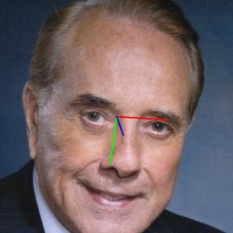

# WHENet

## Introduction

["WHENet"](https://arxiv.org/pdf/2005.10353.pdf) [1] is a lightweight head pose estimation model designed to run in real time on mobile devices.
The network architecture is based on EfficientNet-B0 [2].
It regresses the position of the head using [Euler angles](https://en.wikipedia.org/wiki/Euler_angles) (yaw, pitch, roll). 
Please look at `example.py` for an example of how to interpret the output of the model.

## Model Information

Information   | Value
---           | ---
Input shape   | RGB image (224, 224, 3)
Input example |  ([Image source](https://commons.wikimedia.org/wiki/File:Bob_Dole,_PCCWW_photo_portrait_(1).JPG), Public domain)
Output shape  | Yaw tensor of size 120, Pitch and Roll tensors of size 66, representing the output angle distribution in bins of 3 degrees.
Output example | 
FLOPS | 781M
Number of parameters | 4.4M
File size (int8) | 5.0M
Source framework | TensorFlow (Keras)
Target platform | MPUs

## Version and changelog

Initial release of quantized int8 model.

## Tested configurations

The int8 model has been tested on i.MX 8MP and i.MX 93 (BSP LF6.1.22_2.0.0) using benchmark-model.

## Training and evaluation

The model has been trained by the original authors on the [300W-LP](https://www.tensorflow.org/datasets/catalog/the300w_lp) dataset [3] and the CMU Panoptic Dataset [4].

It has been evaluated on the BIWI [5] and AFLW2000 [3] datasets.

More information about the training and evaluation of the network is available in the [original paper](https://arxiv.org/pdf/2005.10353.pdf).

## Conversion/Quantization

We convert the original model from Keras to TensorFlow Lite, and calibrate the quantization using 100 images from 300W-LP [3].

## Use case and limitations

According to the authors of the paper, WHENet is applicable for full range head yaws thanks to its ability to regress 360 degrees of yaw, 
and has applications such as autonomous driving and retail [1].

## Download and run

To download the TensorFlow Lite model fully quantized in int8 with int8 input and int8 output, follow the top-level README instructions to install Docker and build the Docker image, then run the following command: 

    docker run --rm -v "$PWD:/workspace" nxp-model-zoo recipe.sh

The TensorFlow Lite model file for i.MX 8M Plus and i.MX 93 CPU is `whenet.tflite`. The model for i.MX 93 NPU is in `model_imx93`.

An example of how to use the model is in `example.py`.

## Origin

Model implementation: https://github.com/Ascend-Research/HeadPoseEstimation-WHENet

[1] Zhou, Yijun, and James Gregson. "Whenet: Real-time fine-grained estimation for wide range head pose." arXiv preprint arXiv:2005.10353 (2020).

[2] Tan, Mingxing, and Quoc Le. "Efficientnet: Rethinking model scaling for convolutional neural networks." International conference on machine learning. PMLR, 2019.

[3] Zhu, Xiangyu, et al. "Face alignment across large poses: A 3d solution." Proceedings of the IEEE conference on computer vision and pattern recognition. 2016.

[4] Joo, Hanbyul, et al. "Panoptic studio: A massively multiview system for social motion capture." Proceedings of the IEEE International Conference on Computer Vision. 2015.

[5] Fanelli, Gabriele, et al. "Random forests for real time 3d face analysis." International journal of computer vision 101 (2013): 437-458.