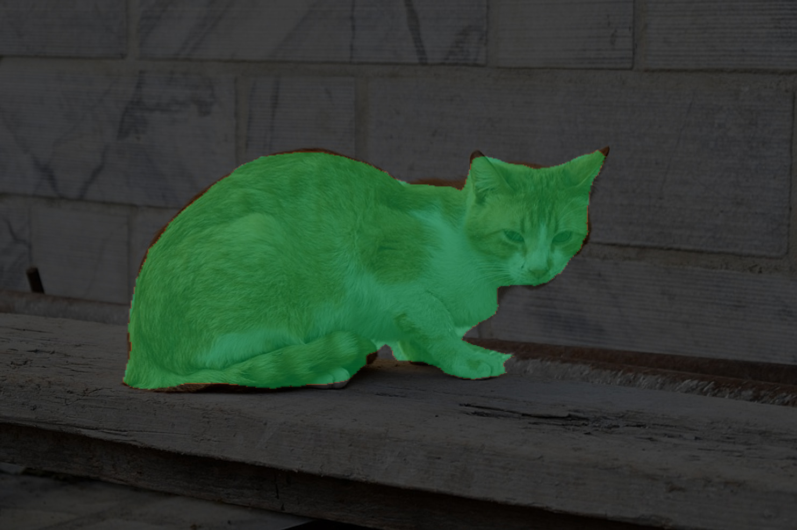

# DeepLabV3

## Introduction

["DeepLabV3-MobileNetV2"](https://tfhub.dev/sayakpaul/lite-model/deeplabv3-mobilenetv2_dm05-int8/1/default/2) is a lightweight deep learning model for semantic image segmentation based on the DeepLabV3 architecture [2] and the MobileNetV2 backbone [3].
Specifically, we use the MobileNetV2 variant with depth multiplier of 0.5 for faster inference.
It classifies each pixel of the input image into 20 classes (+ background class).
Please look at `example.py` for an example of implementation of post-processing and display.

## Model Information

Information   | Value
---           | ---
Input shape   | RGB image (513, 513, 3)
Input example |  ([Image source](https://upload.wikimedia.org/wikipedia/commons/thumb/f/f6/Stray_Cat%2C_Nafplio.jpg/800px-Stray_Cat%2C_Nafplio.jpg), Public domain)
Output shape  | Tensor of size (513, 513, 21) containing output scores for 20 classes (+ background class) for each pixel of the input image.
Output example | 
FLOPS | 1.76B OPS
File size (int8) | 983KB
Source framework | TensorFlow
Target platform | MPUs

## Version and changelog

Initial release of quantized int8 model.

## Tested configurations

The int8 model has been tested on i.MX 8MP (BSP 6.1.22_2.0.0_MX8MP) using benchmark-model.

## Training and evaluation

The model has been trained and evaluated on the [PASCAL VOC dataset](http://host.robots.ox.ac.uk/pascal/VOC/) [1], which features 20 classes.
It achieved a score of 70.19% mIoU on the test set, according to [the source of the model](https://github.com/tensorflow/models/blob/master/research/deeplab/g3doc/model_zoo.md).

The training code can be found in the [TensorFlow Models repository](https://github.com/tensorflow/models/blob/master/research/deeplab/train.py).

## Conversion/Quantization

The original model is converted from TensorFlow to TensorFlow Lite by the original authors. We directly download the converted model.

The quantization procedure can be found in the [TensorFlow Models repository](https://github.com/tensorflow/models/blob/master/research/deeplab/g3doc/quantize.md).

## Use case and limitations

This model obtains good accuracy figures and is quite lightweight. However, the runtime is still somewhat high so it cannot be used for realtime image segmentation.

## Performance

Here are performance figures evaluated on i.MX 8M Plus (BSP LF6.1.22_2.0.0):

Model   | Average latency  | Platform     | Accelerator       | Command
---     | ---              | ---          | ---               | ---
Int8    | 1104ms           | i.MX 8M Plus |   CPU (1 thread)  | /usr/bin/tensorflow-lite-2.10.0/examples/benchmark_model --graph=deeplabv3.tflite
Int8    | 447ms            | i.MX 8M Plus |   CPU (4 threads) | /usr/bin/tensorflow-lite-2.10.0/examples/benchmark_model --graph=deeplabv3.tflite --num_threads=4
Int8    | 586ms            | i.MX 8M Plus |   NPU             | /usr/bin/tensorflow-lite-2.10.0/examples/benchmark_model --graph=deeplabv3.tflite --external_delegate_path=/usr/lib/libvx_delegate.so

## Download and run

To create the TensorFlow Lite model fully quantized in int8 with float32 input and output, run:

    bash recipe.sh

The TensorFlow Lite model file for i.MX 8M Plus is `deeplabv3.tflite`.

An example of how to use the model is in `example.py`.

## Origin

Model implementation: https://github.com/tensorflow/models/blob/master/research/deeplab/g3doc/model_zoo.md

[1] Everingham, Mark, et al. "The pascal visual object classes (voc) challenge." International journal of computer vision 88 (2010): 303-338.

[2] Chen, Liang-Chieh, et al. "Encoder-decoder with atrous separable convolution for semantic image segmentation." Proceedings of the European conference on computer vision (ECCV). 2018.

[3] Sandler, Mark, et al. "Mobilenetv2: Inverted residuals and linear bottlenecks." Proceedings of the IEEE conference on computer vision and pattern recognition. 2018.