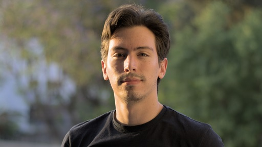
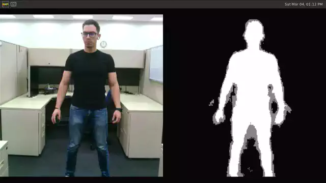

# Selfie Segmenter (MediaPipe)

## Introduction

["Selfie Segmenter"](https://developers.google.com/mediapipe/solutions/vision/image_segmenter) lets you segment the
portrait of a person and can be used to replace or modify the background of an image. Its architecture is based on
MobileNetV3 with added customized decoder blocks for segmentation.

There are two versions of the same model: *general* [256x256x3] and *landscape* [144x256x3]. The *general* version of
this model is more accurate than the *landscape* version since its input image is of bigger size and more features can
be extracted. The *landscape* version runs faster and achieves real-time performance in both CPU (XNNPack delegate) or
NPU (VX Delegate and Ethos-U Delegate).

## Model Information

Information          | Value (General Model)                                  | Value (Landscape Model)
---                  | ---                                                    | ---
Input shape          | RGB image [1, 256, 256, 3]                             | RGB image [1, 144, 256, 3]
Input value range    | [0.0, 1.0]                                             | [0.0, 1.0]
Input example        |        |  
Output shape         | Grayscale mask [1, 256, 256, 1]                        | Grayscale mask [1, 144, 256, 1]
Output value range   | [0.0, 1.0]                                             | [0.0, 1.0]
Output example       |  | 
OPS                  | 127.7 M OPS                                            | 71.6 M OPS
MACs                 | 63.84 M MACs                                           | 35.78 M MACs
File size (FLOAT16)  | 244 KB                                                 | 244 KB
File size (INT8)     | 216 KB                                                 | 216 KB
Source framework     | MediaPipe (TensorFlow Lite)                            | MediaPipe (TensorFlow Lite)
Target platform      | MPUs                                                   | MPUs

## Version and changelog

Initial release of FLOAT16 and quantized INT8 model.

## Tested configurations

The quantized INT8 model has been tested on i.MX 8M Plus and i.MX 93 using `./benchmark_model` tool
(see [i.MX Machine Learning User Guide](https://www.nxp.com/docs/en/user-guide/IMX-MACHINE-LEARNING-UG.pdf)).

## Training and evaluation

The model has been trained on a proprietary dataset which is not provided by MediaPipe. Calibration during
quantization is done with a subset of [COCO dataset](https://cocodataset.org/) [1] that does not belong to the
original training dataset. For this reason, accuracy might be slightly affected.

The ground truths are not available for evaluation of quantized model. As an alternative, the cosine similarity between
the MediaPipe FP16 model and the quantized INT8 model is provided. The evaluation was done using the test dataset
(Selfie) obtained from the
[Selfie-Image-Detection-Dataset](https://www.kaggle.com/datasets/jigrubhatt/selfieimagedetectiondataset?resource=download),
which contains 3,931 images.

Model Version | Avg. Cosine Similarity
---           | ---
General       | 0.970
Landscape     | 0.979

MediaPipe (FLOAT16) General Model | Quantized (INT8) General Model | Cosine Similarity
--- | --- | ---
 |  | 0.9957

MediaPipe (FLOAT16) Landscape Model | Quantized (INT8) Landscape Model | Cosine Similarity
--- | --- | ---
 |  | 0.9980

## Conversion/Quantization

The original FLOAT16 model is converted from TensorFlow Lite (\*.tflite) to TensorFlow Saved Format (\*.pb), and then
back to TensorFlow Lite using post-training quantization optimization for the NPUs.

The conversion script performs this conversion and outputs the FLOAT16 model and INT8 quantized model. 68 images are
used to calibrate the model during quantization. These images do not belong to the original dataset and were obtained
from the [COCO validation dataset](https://cocodataset.org/).

## Use case and limitations

This model can be used for human segmentation from videos in interactive applications. Some possible use cases are
augmented reality and video conferencing.

The model is not expected to work well for people too far away from the camera (~4 meters) or for scenes in which
there are multiple people across different scales. The model should not be used for any form of surveillance or
identity recognition. For more information, please refer to the
[model card](https://storage.googleapis.com/mediapipe-assets/Model%20Card%20MediaPipe%20Selfie%20Segmentation.pdf).

## Download and run

To export the TensorFlow Lite general version model, fully quantized in INT8 with FLOAT32 input and FLOAT32 output,
follow the top-level README instructions to install Docker and build the Docker image, then run the following command: 

    docker run --rm -v "$PWD:/workspace" nxp-model-zoo recipe.sh

To generate the landscape version, run:

```bash
USE_LANDSCAPE=1 bash recipe.sh
```

The TFLite model file for i.MX 8M Plus and i.MX93 is `*.tflite`. An example of how to use the model is in `example.py`.

## Example using NNStreamer

Below is an NNStreamer pipeline example for the Selfie Segmenter model on i.MX 8M Plus with NPU acceleration (VX
Delegate). Output shows the input video from camera and segmentation mask side to side:

```bash
gst-launch-1.0 --no-position v4l2src device=/dev/video3 ! \
  video/x-raw,width=640,height=480,framerate=30/1 ! \
  aspectratiocrop aspect-ratio=1/1 ! \
  imxvideoconvert_g2d ! video/x-raw,width=480,height=480 ! \
  tee name=t t. ! queue max-size-buffers=2 leaky=2 ! \
  imxvideoconvert_g2d ! video/x-raw,width=256,height=256,format=RGBA ! \
  videoconvert ! video/x-raw,format=RGB ! \
  tensor_converter ! \
  tensor_transform mode=arithmetic option=typecast:float32,div:255.0 ! \
  tensor_filter framework=tensorflow-lite model=selfie_segmenter_int8.tflite \
  custom=Delegate:External,ExtDelegateLib:libvx_delegate.so ! \
  tensor_decoder mode=image_segment option1=snpe-depth option2=0 ! \
  imxvideoconvert_g2d ! \
  video/x-raw,width=480,height=480,format=RGBA ! \
  mix. t. ! queue max-size-buffers=2 leaky=2 ! \
  imxcompositor_g2d name=mix latency=30000000 min-upstream-latency=30000000 \
                             sink_1::ypos=0 sink_1::width=480 sink_1::height=480 \
                             sink_0::ypos=0 sink_0::xpos=480 sink_0::width=480 sink_0::height=480 ! \
  waylandsink
```



## Origin

[1] Lin, Tsung-Yi, et al. "Microsoft coco: Common objects in context." European conference on computer vision. Springer, Cham, 2014.

Model card: https://storage.googleapis.com/mediapipe-assets/Model%20Card%20MediaPipe%20Selfie%20Segmentation.pdf

Solution: https://developers.google.com/mediapipe/solutions/vision/image_segmenter

This model was created by: Tingbo Hou, Google; Siargey Pisarchyk, Google; Karthik Raveendran, Google.

MediaPipe models are licensed under [Apache-2.0 License](https://www.apache.org/licenses/LICENSE-2.0.html).
